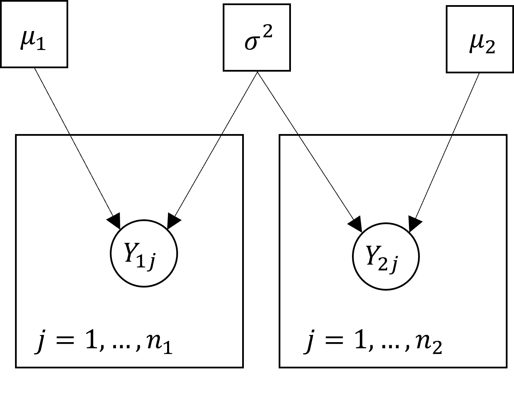
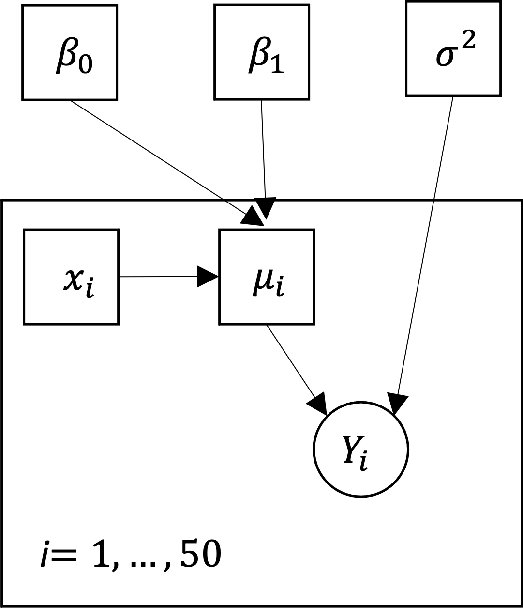

# Introducing JAGS

<center>

{width=300px}

</center>

## Introduction

We will begin by looking at JAGS and then see how the software can be used in the framework of Bayesian statistics in the next chapter. The core idea behind JAGS is that we can learn about a distribution by repeatedly sampling. 

Consider the problem of tossing a coin repeatedly and counting the number of times it lands heads side up. There is statistical theory that tells us that the number of heads follows a binomial distribution with parameters equal to the number of tosses, commonly denoted by $n$, and the probability of the coin landing heads side up on a single toss, denoted by $p$. If the coin is fair then $p=.5$. We could then use the theoretical distribution to calculate values like the mean (average) number of times the coin lands heads side up on 10 tosses or the probability that the coin lands heads side up on exactly 5 of 10 tosses.

However, you could also estimate these values by simulation. Using a physical simulation, you could conduct repeated trials in which you toss a coin 10 times in a row and count the number of times the coin lands heads side up on each trial. You could then estimate the mean number of times the coin lands heads side up by averaging the observed values. You could estimate the probability that the coin lands heads side up on exactly 5 of 10 tosses by the proportion of times this specific event occurs. 

This works for tossing a coin, but it's harder to do with real world experiments. Instead, we can simulated the distribution for most problems more efficiently. The following R code will simulate 1000 tirals for the coin tossing problem and estimate the values above:
```{r, eval = FALSE, echo = TRUE}
## Set parameters
n <- 10 # Number of tosses per trial
m <- 100 # Number of replicate trials

## Simulate number of heads
Y <- rbinom(m, n, .5)

## Estimate the mean
mean(Y)

## Estimate the probability the coin lands heads side up 5 times
sum(Y == 5)/m
```
Run the code in `R`. The true values are 5.0 and .25, and your results should be close to this -- but they will not be exact. You will also get different answers if you repeat the simulation. 

The reason is that there is random variation in the simulation. Each time you run 1000 trials then simulated data will be different. However, if you increase the number of replicates (`m` in the code above), then the results will get closer and closer to the truth. Although there is always some level of variation, if `m` is big enough then the uncertainty will be small enough to ignore. 

JAGS is doing exactly this, but it is able to simulate from much more complicated distributions then we could work with easily in R. The name is an acronym that stands for "Just Another Gibbs Sampler", though Gibbs sampling is just is just one of the methods that it implements.  In general, the sampling methods fall used in JAGS fall into the class of Markov chain Monte Carlo methods or MCMC for short. Section 3 will connect the problem of sampling to Bayesian inference and provide more details on MCMC. However, we'll start by looking at the basic syntax for defining models JAGS and how JAGS can be run `R`. 

## Visualing Statistical Models

Much of the syntax for JAGS will look familiar if you have programmed in R before. However, the objective is fundamentally different. R is a functional programming language meaning that it works by providing input to functions that then return output which can be passed to new functions in turn. For example, you might load data with `read.csv()` which takes the name of a file as input and returns a data frame as output. You might then pass the data frame to `lm()` which fits a linear regression model and returns summary output. Some functions may be very complicated, but they are all essentially black-boxes that take some inputs (numbers, data frames, vectors etc), do some calculations, and return some outputs (new numbers, data frames, or vectors). 

The purpose of the JAGS language is to define the structure of a statistical model. JAGS code does not define a sequence of steps in which objects are passed to functions that return new objects. Instead, the code defines the relationships between variables in statistical model. Behind the scenes, JAGS is constructing a graph that describes how the variables are connected. The variables are referred to as nodes in the graph, and the nodes belong to one of two types: 

1) Deterministic Nodes 
    A node is deterministic if the value of the node is unique given its inputs. For example, a node that is the sum of two values is deterministic because it will always produce the same sum from the same input. 
    
2) Stochastic Nodes
    A node is stochastic if its inputs define a distribution from which a value can be drawn. For example, a stochastic node might define a normal distribution which depends on its mean and variance. Each time the sampler is run JAGS will draw a value from the distribution at random, and so the value of the node will change even if the mean and variance supplied are the same. 

The final graph must also satisfy two conditions to define a valid statistical model:

1) Directed
    This simply means that there is a direction to each of the connections in the graph. Each node depends on the values of some nodes, called its parents, on is depended on by other nodes, called its children.  In the example of the normal distribution, the mean and variance are parents and the stochastic node is their child. 
    
2) Acyclic
   A graph is cyclic if you can get from any node back to itself by following the connections in the right directions. A graph is acyclic if it isn't cyclic. This means that a node can't be its own parent (or grandparent or great-grandparent or...). 
   
We say that the final graph is a Directed Acyclic Graph or DAG short. The streets in a city form a DAG if all streets are one-way and no matter where you start from you can never get home. Don't by a house there!

It often helps to draw out the DAG for a model before trying to write the code in JAGS. Here are the DAGS for some simple models. There are different conventions for drawing DAGS. I will use squares to identify deterministic nodes and circles to identify the stochastic nodes, with arrows showing the directed relationships. 

### Example 1: Coin Tossing

The DAG for the coin tossing example has three nodes, $p$, $n$ and $Y$. The parameter, $p$ and $n$, are deterministic nodes and $Y$ is stochastic. The distribution of $Y$ depends on $p$ and $n$, and so the DAG would look like this:

{width=300px}

### Example 2: Two-Sample Problem

Here I will consider the setup of a two-sample $t$-test. The two-sample $t$-test assumes that we have observations on some response variable (e.g., weight of birds or length of fish) from two groups of individuals. The observations in each group are assumed to be normally distributed so that the variance is the same in the two groups, but the means are different. 

I will let $n_1$ and $n_2$ denote the number observations from each group (these don't have to be equal), $\mu_1$ and $\mu2$ the means, and $\sigma^2$ the common variance. The individual observations will be denoted by $Y_{11},\ldots,Y_{1n_1}$ for the first group and $Y_{21},\ldots,Y_{2n_2}$ for the second group. 

Once again, the parameters, $\mu_1$, $\mu_2$, and $\sigma$, are deterministic nodes and the observations, $Y_{11},\ldots,Y_{1n_1}$ and $Y_{21},\ldots,Y_{2n_2}$, are stochastic nodes. The DAG might be drawn like this:

{width=300px}

The larger square boxes in this diagram are a space saving measure. They indicate that the structure inside is repeated, with indices of the replicates indicated in the bottom corner. E.g., the each $Y_{1j}$ shares the same distribution depending on $\mu_1$ and $\sigma^2$. This avoids having to draw separate nodes for each observation. 

### Example 3: Linear Regression

As a third example, we'll consider the simple linear regression model relating the mean of a response variable to the value of some predictor. Let $(Y_1,x_1),\ldots,(Y_n,x_n)$ denote paired observations where $Y_i$ is the response variable and $x_i$ is the predictor. For example, we might predict the length of a fish based on its age. The linear regression model assumes $Y_$ is normally distributed with mean
$$
\mu_i = \beta_0 + \beta_1 x_i.
$$
Here $\beta_0$ is the intercept and $\beta_1$ is the slope. The variance of the response is assumed to be a constant, usually denoted by $\sigma^2$. 

In this model the parameters $\beta_0$, $\beta_1$, and $\sigma^2$ are deterministic. The predictor variable, $x_i$, is also a deterministic node since the model assumes that the value is observed without error. The only stochastic nodes are the response varibles, $Y_i$. The DAG for the simple linear regression model might be drawn as:

{width=300px}
Note that the node for the mean, $\mu_i$, is not strictly necessary. We could have connected all of the other nodes directly into $Y_i$. However, I find it helpful to include this node because it distinguishes the nodes that affect the mean of the response ($\beta_0$, $\beta_1$, and $x_i$) and the nodes that affect the variance (just $\sigma^$ in this case). 

<!-- ## Conditional Distributions -->

<!-- When you run JAGS you will usually supply values for some of the nodes in the graph. JAGS will then sample values for the remaining nodes in the graph. Specifically, JAGS samples from the conditional distributions of each of these nodes given the values you supplied for the remaining nodes. That is, it samples from the distribution of each unobserved node given the current values of both its parents and its children.  -->

<!-- ### Example 2: Craps -->
<!-- As an example of conditional distributions, suppose that we want to know the probability of rolling a 5 in craps -- a simple dice game in which players roll a pair of six sided die and bet on sum of the two values. The smallest possible outcome (the sum of the values on the two die) is 2 (two 1s) and the largest is 12 (two 6s). The probabilities of the different outcomes are given in the following table: -->
<!-- ```{r} -->
<!-- ## Craps probabilities -->
<!-- craps <- tibble(Outcome = as.character(2:12), -->
<!--                 Probability = round(c(1,2,3,4,5,6,5,4,3,2,1)/36,3)) -->

<!-- t(craps) %>% -->
<!--   kable(digits = 3) -->
<!-- ``` -->
<!-- This means that if you roll the pair of die many, many times then the proportion of times the sum equals two will be very close to .028, the proportion of times the sum equals three will be very close to .056, etc.  -->

<!-- Now suppose that you know that the value on the first die is 3. There is only one value for the second die that will produce the outcome 5, it's 2, and so the probability of rolling a 5 given that the value on the first die is 3 is 1/6=.167. We say that the conditional probability of the outcome 5 *given that the value on the first die is 3* is .167. If you were to fix the value of the first die to be 3 and roll the second die many, many times then the proportion of times that the sum is 5 would be very close to .167.  -->

<!-- In this case, it is very simple to compute the conditional probabilities of different sums given the value of one die or other constraints (e.g., that the number on the first die is even). However, if the distribution is complex then it can be very difficult to derive the conditional distributions mathematically. JAGS solves this problem by simulating from the conditional distributions numerically rather than trying to derive mathematical formulas.   -->

<!-- ### Exercise 2: Dominant and Recessive Traits -->

<!-- The classic genetics problem assumes that there is a single gene for eye colour with two alleles: a dominant allele B that produces brown eyes and a recessive allele b that produces blue eyes. An individual has brown eyes if they have genotype BB or Bb and blue eyes if they have genotype bb.  -->

<!-- Suppose that a population of 100 individuals contains 25 individuals with genotype BB, 50 individuals with genotype Bb, and 25 individual with genotype bb.  -->

<!-- 1) What is the probability that a randomly selected individual has at least one copy of the recessive allele? -->

<!-- 2) What is the probability that a randomly selected individual has at least one copy of the recessive allele give that they have brown eyes? -->

<!-- The [solution](#solution2) is given in the final chapter.  -->

## Basic JAGS syntax

### Example 1 (continued): Coin Tossing
To introduce the basic syntax of JAGS, we will look at the code for the coin tossing experiment. To make the problem more concrete, I will assume that the coin is fair so that $p=.5$ and that the coin is tossed $n=10$ times (as in the previous `R` code). This is what the JAGS code looks like:
```{r eval =FALSE, echo=TRUE}
model{
  # Parameters
  p <- .5
  n <- 10
  
  # Distributions
  y ~ dbinom(p,n)
}
```
This code is also provided in the file `Examples/Example_1/example_1.jags`.

Let's break this down.

1) Model Block
    First, the code must be enclosed in a block of text starting with `model{` at the top of the file and ending with `}`. This may seem a little odd. However, JAGS also allows a second block enclosed by `data{...}` that defines data manipulations that are to be run before the model is run. We will do all of our data manipulations in `R` so we won't need the second block, but you still need to enclose the code with `model{...}` so JAGS knows where to look.

2) Node Definitions
    Each node in the model is defined by a statement of the form 
\begin{center}
`variable <- definition`.
\end{center}
or
\begin{center}
`variable ~ definition`
\end{center}
In this model, $p$ and $n$ are deterministic, so they are defined with `<-` and `y` is deterministic, so it is defined with `~`. 

3) Distributions
    Each stochastic node must be assigned a distribution. These are defined by functions that all begin with `d` for distribution and accept the names of the parent nodes as arguments. The function `dbinom(n,p)` indicates that `y` follows a binomial distribution with size `n` and probability of success `p`. 
    
4) Comments
    The lines beginning with the hash symbol (`#`) are comments, just as in `R`. These are ignored by JAGS and have no effect on the output. They are simply there to help you or anyone else reading your code.  

### Example 2 (continued): Two-Sample Problem

Now we'll look at the code for the two-sample $t$-test. To make the situation more concrete I will assume that $n_1=10$ and $n_2=1$,  $\mu_1=5$ and $\mu_2=10$, and $\sigma^2=2$. This is what the code looks like:
```{r, eval=FALSE, echo = TRUE}
model{
  # Parameters  
  mu1 <- 5
  mu2 <- 10
  sigmasq <- 2
  
  # Distributions
  for(j in 1:10){
    y1[j] ~ dnorm(mu1,1/sigmasq)
  }
  
  for(j in 1:15){
    y2[j] ~ dnorm(mu2,1/sigmasq)
  }
}
```
This code is provide in the file `Examples/Example_2/example_2.jags`. Let's break this down. Here is the breakdown:

1) Node Definitions
    The variables `mu1`, `mu2`, and `sigmasq` represent the values of the parameters $\mu_1$, $\mu_2$, and $\sigma^2$ and are defined as deterministic nodes. On the other hand, $y1[j]$ and $y2[j]$ representing $Y_{1j}$ and $Y_{2j}$ are defined as stochastic nodes. The function `dnorm()` indicates that they are assigned normal distributions, and the function requires two arguments to complete their definitions. The first is the mean and the second is the precision which is equal to the reciprocal of (one over) the variance. 

3) Comments
    The lines beginning with the hash symbol (`#`) are comments, just as in `R`. These are ignored by JAGS and have no effect on the output. 

4) Loops 
    The major addition here is the for loop and the use of the square bracket notation. The for loop indicates that the same structure is repeated for many nodes, matching the use of the squares surrounding nodes in the DAGs. The notation for the for loop is the same as in `R` -- but it is not doing the same thing. A for loop in `R` which performs sequential calculations. Instead, it is just a convenient way to implement the same structure repeatedly. The model could also have been written with the lines
```{r,echo=TRUE,eval=FALSE}
y1[1] ~ dnorm(mu1,1/sigmasq)
y1[2] ~ dnorm(mu1,1/sigmasq)
y1[3] ~ dnorm(mu1,1/sigmasq)
y1[4] ~ dnorm(mu1,1/sigmasq)
y1[5] ~ dnorm(mu1,1/sigmasq)
y1[6] ~ dnorm(mu1,1/sigmasq)
y1[7] ~ dnorm(mu1,1/sigmasq)
y1[8] ~ dnorm(mu1,1/sigmasq)
y1[9] ~ dnorm(mu1,1/sigmasq)
y1[10] ~ dnorm(mu1,1/sigmasq)
```
instead, but that is awfully tedious (and we only have 10 observations).
    
5) Vector Indexes
    Along with the for loop come the square brackets around `j` in the definition of `y1` and `y2`. This notation indicates that these nodes form one-dimensional arrays (i.e. vectors) that are indexed by the value of `j`. This is the same notation used to define vectors in `R`. This is useful for organizing data and repeating structures without having to define new nodes. Arrays of any dimension can be constructed by adding more indices separated by commas. For example, `X1[i,j]` would define `X1` to be a two-dimensional array (a matrix) indexed by `i` and `j`, `X2[i,j,k]` would define `X2` to be a three-dimensional array indexed by `i`, `j`, and `k`, etc. In most cases, JAGS will infer the size of an array from the rest of the code so you do not need to define this explicitly. E.g., JAGS knows that `y2[]` has 10 elements because of the index on the for loop.

## Running JAGS from R

### rjags

There are several packages that allow you to connect `R` and JAGS. This allows you to process your data in `R` and then to easily retrieve the output from JAGS to summarize the results of your analysis. We'll make use of the `rjags` package. The two main functions we will use from the package are `jags.model()` which initializes the model and `coda.sample()` which runs the model to generate samples from the conditional distributions of the unobserved nodes.

### `jags.model()`

The function `jags.model()` compiles the model and adapts the sampler (which we will discuss later in the section on Markov chain Monte Carlo). The two key arguments of the function are:

- `file`: the name of the file containing a description of the model in the JAGS language.
- `data`: a list or environment containing the data. Only the values of stochastic nodes may be included in the list. If a stochastic variable is defined in the data then its value will be treated as fixed by JAGS. Otherwise, JAGS will sample from the distribution of the variable.  

### `coda.samples`()

There are a couple of functions that allow you to generate samples from a model. I like the function `coda.samples()` because the output is formatted to feed directly into functions to summarize the results (which you will see in the next subsection). The key arguments for this function are:

- `model`: a JAGS model object created with the function `jags.model()`.
- `variable.names`: a character vector naming the variables whose values you want returned. 
- `n.iter`: the number of samples to generate (also referred to as the number of iterations)

### Example 1 (continued): Coin Tossing
The following code with compile the model for the coin tossing example and then return 100 samples. Note that you only need to load the `rjags` package once in each `R` session.
```{r, echo = TRUE, eval=FALSE}
# Load rjags
library(rjags)

# Initialize model
jags_model_1 <- jags.model("Examples/Example_1/example_1.jags")

# Generate samples
jags_samples_1 <- coda.samples(jags_model_1, "y", n.iter = 100)
```
Copy this code into `R` to run the model. If the model runs successfully then you should see output like this. If you have trouble running the model then I am happy to help!
```{r, echo = TRUE, eval = FALSE}
Compiling model graph
   Resolving undeclared variables
   Allocating nodes
Graph information:
   Observed stochastic nodes: 0
   Unobserved stochastic nodes: 1
   Total graph size: 3

Initializing model

  |**************************************************| 100%
```
If you print out the object containing the sample like this:
```{r, eval = FALSE, echo = TRUE}
jags_samples_1
```
then you will see something like this:
```{r, eval = FALSE, echo = TRUE}
[[1]]
Markov Chain Monte Carlo (MCMC) output:
Start = 1 
End = 100 
Thinning interval = 1 
        y
  [1,]  4
  [2,]  3
  [3,]  3
  [4,]  6
  [5,]  5
  [6,]  5
  [7,]  6
  [8,]  4
  [9,]  7
 [10,]  6
```
The header tells you a bit about how the sampler was run (don't worry about this for now) followed by the sampled values of $y$. The values in your sample will differ because of random variation in the sampling process. You'll see below how we can compute summary statistics from the output. 

### Example 2 (continued): Two-Sample Problem

You can then run following code to compile the model for the two-sample problem and then generate 100 samples for each of the 25 elements of `y1` and `y2`:
```{r, echo = TRUE, eval = FALSE}
# Initialize model
jags_model_2 <- jags.model("Examples/Example_2/example_2.jags")

# Generate samples
jags_samples_2 <- coda.samples(jags_model_2, c("y1","y2"), n.iter = 100)
```
If the model runs properly then you should see the following output. 
```{r, echo = TRUE, eval = FALSE}
Compiling model graph
   Resolving undeclared variables
   Allocating nodes
Graph information:
   Observed stochastic nodes: 0
   Unobserved stochastic nodes: 25
   Total graph size: 30

Initializing model

  |**************************************************| 100%
```
If you print out the object containing the sample like this:
```{r, eval = FALSE, echo = TRUE}
jags_samples_2
```
This will print out a very large matrix whose first rows will look something like this:
```{r, echo = TRUE, eval = FALSE}
[[1]]
Markov Chain Monte Carlo (MCMC) output:
Start = 1 
End = 100 
Thinning interval = 1 
          y1[1]    y1[2]     y1[3]     y1[4]    y1[5]    y1[6]     y1[7]
  [1,] 6.303602 5.380457  3.546061 6.9884837 5.884908 4.073670 6.4834990
  [2,] 2.433702 4.914656  4.107135 5.6893832 6.979673 7.130535 5.1671628
  [3,] 7.402418 6.204997  2.840362 0.9656478 6.968495 3.394275 5.2635536
  [4,] 7.324964 4.333515  6.151372 5.4581757 4.733221 6.159151 3.3714016
  [5,] 3.755403 6.504914  4.269162 4.7427323 3.388939 2.982544 4.0687450
```
The first column provides the samples generated for `y1[1]`, the second for `y1[2]`, etc. Again, the values in your sample will not be the same because of random variation.

## Summarizing the Results

Once JAGS has generated the samples, you need to process the samples to summarize the results. This involves computing summary statistics for the distribution (e.g., means, medians, variances, quantiles). You can also summarize the distribution graphically by plotting different summary statistics.  

### coda

The `coda` package contains functions to summarize the samples generated by JAGS. In particular, you can use the `summary()` function to generate sample statistics for each of the monitored variables. The output from  this function contains 3 pieces. 

  1) Sampling
      The first block provides basic information the running of the sampler, including the number of samples that were generated. 
      
  2) Summary Statistics
      The block lists the mean and standard deviation for each variables, along with two further statistics relating to the sampler which are discussed in Chapter 5. 

  3) Quantiles 
      The final block provides estimates of the percentiles for each variable. The values in the column labelled `X%` represent the `X`-th percentile of the distribution for that variable -- the value which is greater than exactly `X`% percent of the samples. The 50-th percentile is the median of the distribution.

### Example 2 (continued): Coin Tossing
```{r, echo = FALSE, eval = TRUE}
## Load saved output
jags_model_1 <- readRDS("Output/example_1_jags_model.rds")
jags_samples_1 <- readRDS("Output/example_1_jags_samples.rds")
```
The following code loads the `coda` package and then summarizes the results from the previous model. Remember that you only need to load the package once each time you run `R`.
```{r, eval = FALSE, echo = TRUE}
## Load coda package
library(coda)

## Compute summaries
summary(jags_samples_1)
```
Copy this code and run it in `R`. The output should look like this:
```{r echo=TRUE, eval=FALSE}
Iterations = 1:100
Thinning interval = 1 
Number of chains = 1 
Sample size per chain = 100 

1. Empirical mean and standard deviation for each variable,
   plus standard error of the mean:

          Mean             SD       Naive SE Time-series SE 
        5.1100         1.6385         0.1639         0.1639 

2. Quantiles for each variable:

 2.5%   25%   50%   75% 97.5% 
    2     4     5     6     8 
```
Based on my samples, the mean value of $Y$ was 5.11 and the standard deviation was 1.64. 95% of the observations were between 2 and 8, and the median (the value so that half the observations are below and half are above) was 5. The other entries (Naive SE and Time-series SE) relate to the performance of the sampler, and we will ignore these for now. As before, the values in your output may differ slightly. If we generated enough samples then our results would be exactly the same. 

### Example 1 (continued): Two-Sample Problem
```{r, echo = FALSE, eval = TRUE}
## Load saved output
jags_model_2 <- readRDS("Output/example_2_jags_model.rds")
jags_samples_2 <- readRDS("Output/example_2_jags_samples.rds")
```

The following code summarizes simulated data for the two-sample $t$-test: 
```{r, eval = FALSE, echo = TRUE}
## Compute summaries
summary(jags_samples_1)
```
For this simple model, we can compute the exact values for these statistics. The true mean and standard deviation for each `y1[j]` are 5 and $\sqrt{2}=1.414$. The true percentiles are 2.228, 4.046, 5.000, 5.954, and 7.772. The true mean and standard deviation for each `y2[j]` are 10 and $\sqrt{2}=1.414$. The true percentiles are 7.228, 9.046, 10.000, 10.954, and 12.772. You should see that the values reported are close, but not exactly equal, to the true values. The reason is that they are computed from a sample which is subject to variation. Each time you run JAGS you will get slightly different output. However, as you increase the number of iterations, the values you see in the summary output should get closer and closer to the truth. 

### ggmcmc

It is often helpful to look at the summary statistics graphically, especially if your model contains a large number of functions. We can do this easily using the functions in the `ggmcmc` package. The plotting functions in the package require that the output from JAGS first be processed with the functions in `ggs()`. For example, the following code will load the package and process the output for the second example:
```{r echo = TRUE, eval = FALSE}
## Load package
library(ggmcmc)

## Construct ggs object
ggs_2 <- ggs(jags_samples_2)
```
The processed otuput can then be passed to the other functions, whose names all start with `ggs_`. The function `ggs_caterpillar` creates what is called a caterpillar plot visualizing the summary statistics for each sampled value:
```{r echo = TRUE, eval = FALSE}
## Create caterpillar plot
ggs_caterpillar(ggs_2, sort = FALSE)
```
A caterpillar plot is very like a boxplot. It summarizes the distribution of a quantity by plotting the values of certain summary statistics. For each of the sampled values, labelled on the left side, the point represents the posterior mean, the thick bar represents the extents of the 50% interval formed by the 25 and 75%-iles, and the thin bar represents the extents of the 95% interval formed by the 2.5 and 97.5%-iles. This plot very clearly shows the difference between the two groups. All of the sampled means for the first group are near 5 and all of the sampled means for the second group are near 10.

## Passing Data to JAGS

In most cases, you will want to pass data from `R` into JAGS. Note that the values of `mu1`, `mu2`, and `sigmasq` are specified directly in the model in our current implementation of the two-sample problem. This means that you need to edit the code if you want to generate a new sample with different values of these parameters.

An easier way to do this is to pass the values of these parameters from `R` into JAGS instead of assigning values to these parameters within the JAGS model file. This is done using the `data` argument of the `jags.model()` function. The value supplied to this argument must be a named list. The syntax to create the list is
```{r echo=TRUE, eval=FALSE}
list(variable1 = value1, variable2 = value2, ...)
```
The names of the variables in the list must match the names of the nodes in the JAGS code. JAGS will then assign the values to these nodes before it runs the sampler.

### Example 2 (continued): Two-Sample Problem
To pass the parameters to the two-sample problem as data we need to remove the lines in the code that set the values of these nodes. The new code will only contain the lines defining the stochastic nodes:
```{r echo = TRUE, eval=FALSE}
model{
  # Distributions
  for(j in 1:10){
    y1[j] ~ dnorm(mu1,1/sigmasq)
  }
  
  for(j in 1:15){
    y2[j] ~ dnorm(mu2,1/sigmasq)
  }
}
```
This code is provided in the file `Examples/Example_2/example_2b.jags`. 

The following code reruns the model from `R`. However, it includes code to construct the list `jags_data_2b` which defines the values of the parameters and then passes this to the function `jags.model()`.  
```{r, echo = TRUE, eval = FALSE}
# Construct data list
jags_data_2b <- list(mu1 = 5, mu2 = 10, sigmasq = 2)

# Initialize model
jags_model_2b <- jags.model("Examples/Example_2/example_2b.jags", jags_data_2b)

# Generate samples
jags_samples_2b <- coda.samples(jags_model_2b, c("y1","y2"), n.iter = 100)
```
Try changing the values of `mu1`, `mu2`, and `sigmasq` and see how this affects the results. 