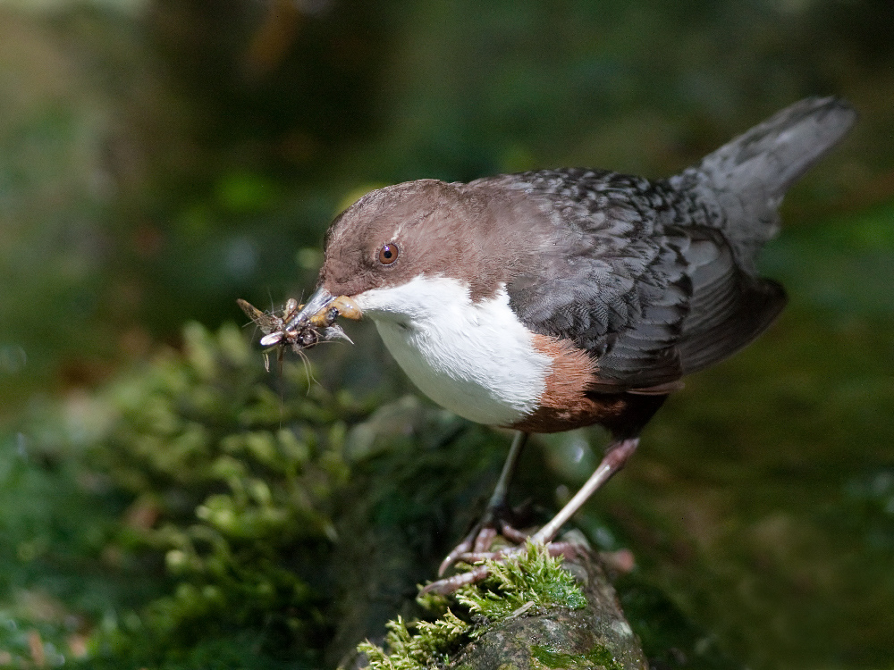

# Ecological Models {.tabset}

## Introduction

We will look at versions of three different models to illustrate the application of Bayesian inference in the analysis of ecological data. First, we will consider a simple closed population model. Then we will look at an implementation of the Cormack-Jolly-Seber (CJS) model for open populations, and finally we will consider a multi-state version of the CJS model.

## Closed Population Models

<center>

{width=500px}

</center>

### Two-Sample Experiment

The simplest mark-recapture study is one in which individuals are captured on only two occasions. A sample of individuals are captured on the first occasion, marked, and returned to the population. A second sample is then taken after allowing sufficient time for the marked individuals to mix back into the population (but not so long that individuals can enter or leave the population). This sample will contain both marked and unmarked individuals, and we can use the ratio of marked and unmarked individual to estimate the size of the population.

Let $n_1$ denote the number of individuals captured and marked in the first sample, $n_2$ the number of unmarked individuals captured in the second sample (i.e., the number in the second sample that were not captured in the first sample), $m$ the number of individuals captured in both, and $N$ the unknown population size. One way to estimate the population size is to equate the proportion of marked individuals captured in the second sample is the same as the proportion of marked individuals in the entire population:
$$
\frac{m}{m + n_2}=\frac{n_1}{N}.
$$
Solving this equation for $N$ provides the estimator
$$
\hat{N}_{LP} = \frac{n_1(m + n_2)}{m}
$$
This is commonly known as the Lincoln-Petersen estimator (hence the subscript LP). 

To implement this model in the Bayesian frawework we need to describe the distributions of the observed data and then assign prior distributions to the unknown parameters. If we assume that all individuals in the population have the same probability of capture, which I will denote by $p$, then $m$ follows a binomial distribution with parameters $n_1$ and $p$ and $n_2$ follows a binomial distribution with parameters $N-n_1$ and $p$. I will let $N_0=N-n_1$ denote the number of individuals in the population that were not captured and marked in the first sample. The DAG for this model looks like this:

{width=300px}
Note that we can estimate the capture probability by $\hat p=m/n_1$ the proportion of marked individuals recaptured on the second occasion. Using this, the Lincoln-Petersen estimator can be re-written as
$$
\hat{N}_{LP} = n_1 + \frac{n_2}{\hat p}.
$$


As noted before, the binomial distribution is implemented in JAGS with the function `dbinom()` and so the data portion of the model would look like this:
```{r echo=TRUE,eval=FALSE}
  # Data distribution
  m ~ dbinom(p,n1)
```
Unless we have previous information about the capture probability, we might it a uniform prior from 0 to 1. This distribution indicates that it is equally likely for $p$ to take any value and is coded like this:
```{r eval=FALSE, echo=TRUE}
  # Prior distributions
  p ~ dunif(0,1)
```
Finally, we can add code to estimate the total population size using the same formula as the Lincoln-Petersen estimator. This is called a derived parameter because it is derived from the values of other parameters in the model (in this case $p$):
```{r eval=FALSE, echo=TRUE}
  # Derived variables
  N <- n1 + n2/p
```
Putting this together, the full model is given by:
```{r eval=FALSE, echo=TRUE}
model{
  # Data distribution
  m ~ dbinom(p,n1)

  # Prior distribution
  p ~ dunif(0,1)

  # Derived variables
  N <- n1 + n2/p
}
```
The code for this model is provided in the file `Examples/Example_5/example_5a.jags`.

#### Example 5: Snowshoe Hares (Two-Samples)

As an example, we will analyse data from a study of snowshoe hares. Hares were sampled from the population on 6 different occasions, but we will focus just on the first two samples for now. A total of $n_1=16$ hares were captured and marked in the first sample of which $m=4$ were recaptured in the second sample. The second sample also contained a further $n_2=24$ unmarked hares. The LP estimate for the population size given these values is 112.

The model can be run in JAGS with the following code:
```{r echo=TRUE, eval=FALSE}
## Construct JAGS data
jags_data_5a <- list(n1 = 16, n2 = 24, m = 4, pN0 = rep(1,1000))
  
## Compile model
jags_model_5a <- jags.model("Examples/Example_5/example_5a.jags", jags_data_5a)

## Generate samples
jags_samples_5a <- coda.samples(jags_model_5a, c("p","N"), n.iter = 1000)

## Compute summary statistics
summary(jags_samples_5a)
```
You should find that the posterior mean for $N$ is about 116 and that the 95% credible interval extends from about 60 to 250. Again, your exact results may differ somewhat because of random variations in the sampling. 

### More than Two Samples -- Constant $p$

Suppose now that more than two samples are taken from the population. Each time a sample is taken we record the identities of any individuals that were captured and marked in a previous sample, mark any newly captured individuals, and return all of the individuals back into the population. The times when the samples are taken are called the capture occasions. The data from this experiment can be recorded in the form of a capture history for each individual -- a string of 0s and 1s indicating on which occasions the individual was captured. For example, if an experiment had 5 capture occasions then the history 10101 would indicate that the individual was captured on three occasion -- the first (when it was marked), the third, and the fifth. 

We'll start by assuming that the capture probability is the same on all occasions, and again denote this with $p$. This is often referred to as having constant $p$. The JAGS code to fit the model data is in the file `Examples/Example_6/example_6a.jags`. The code is a bit more complicated, and I won't go through all of the details here (though I am happy to answer any questions). However, there is one thing that needs to be discussed.

The way I have implemented this model uses a process called data augmentation to estimate the population size. There is a technical problem with MCMC sampling that makes the methods challenging if the size of the number of individuals is not fixed. A very clever way to avoid this is to embed the actual population inside a much larger population of hypothetical animals. Along with the capture histories of the individuals, we include a large number, call it $M$, of capture histories of all 0s. We then assign these hypothetical individuals to two groups: animals that were actually part of the population and truly evaded capture for the entire experiment and animals that weren't actually part of the population at all. Within the model, each individual is assigned a variable, called `alive`, that takes one of two values, 1 if the individual was actually part of the population and 0 if it was not. Marked individuals must be alive because they were captured. Each of the added individuals has the potential to be alive or not, and the total population size is equal to the number of alive individuals. 

#### Example 6: Snowshoe Hares (Full Data)

To illustrate the model with more than two samples we will analyse the full snowshoe hare data set. The data is provided in the file `Examples/Example_6/snowshoe_hare.csv`. Each row in the data set represents the capture history for 1 individual. For example, the capture history of the first individual is 111111 indicating that it was captured on all 6 occasions while the capture history for the 10th individual is 100100 indicating that it was captured only on the 1st and 4th occasions. A total of 68 hares were captured at least one time.

The following code will fit the model and generate summary statistics. I have chosen to add 1000 extra unobserved individuals to the population, represented by the value `M` in the code below. The value is somewhat arbitrary and will not affect the results, provided that it is big enough. Note that I have included the variable `alive` as part of the data. The first 68 entries correspond to the marked individuals. These all take the value 1, meaning that the individuals must be part of the actual population. The remaining values are set to `NA` which indicates that they will be sampled by JAGS.
```{r, echo=TRUE,eval=FALSE}
## Load data
hare <- read_csv("Examples/Example_6/snowshoe_hare.csv")

## Construct JAGS data
jags_data_6 <- list(n = 68,
                    M = 1000, 
                    K = 6, 
                    alive = rep(c(1,NA),c(68,1000)),
                    caps = rbind(as.matrix(hare),matrix(0,1000,6)))

## Compile model
jags_model_6a <- jags.model("Examples/Example_6/example_6a.jags", jags_data_6)

## Generate samples
jags_samples_6a <- coda.samples(jags_model_6a, c("p","N"), n.iter = 1000)

## Compute summary statistics
summary(jags_samples_6a)
```
You should find that the posterior mean of $N$ is about 75 and that the 95% credible interval extends from about 70 to 83. 

### More than Two Samples -- Time-Varying $p$

There are many reasons that the capture probability might change across the capture occasions. Perhaps the capture of individuals depends on weather conditions. In this case, we might want the model to allow the capture probability to change over time. The code for this model is provided in `Examples\Example_6\example_6b.jags`. 

#### Example 6 (continued): Snowshoe Hares (Full Data)
The following code will fit the model with time-varying capture probabilities to the snowshoe hare data. Note that you do not need to recreate the data object:
```{r, echo=TRUE,eval=FALSE}
## Compile model
jags_model_6b <- jags.model("Examples/Example_6/example_6b.jags", jags_data_6)

## Generate samples
jags_samples_6b <- coda.samples(jags_model_6b, c("p","N"), n.iter = 1000)

## Compute summary statistics
summary(jags_samples_6b)
```

We can also visualize this summary statistics. In this case, $p$ and $N$ are on very different scales. If we plot them both on the same axes then the plotting symbols for the summary statistics of $p$ all lie on top of each other. To avoid this, we can separate the plots for $N$ and $p$:
```{r echo=TRUE, eval=FALSE}
## Create ggs object
ggs_6b <- ggs(jags_samples_6b)

## Draw caterpillar plot for N
ggs_caterpillar(ggs_6b, "N", sort = FALSE)

## Draw caterpillar plot for p
ggs_caterpillar(ggs_6b, "p", sort = FALSE)
```

### More than Two Samples -- Hierarchical $p$

The constant $p$ and time-varying $p$ models represent two ends of the spectrum. In one case, we assume that the capture probability is exactly the same on each occasion. In the other, we let the capture probabilities vary completely separately from one another. However, the truth is likely to be somewhere in between. Even if the capture probabilities are not identical, if you capture individuals from the same population in the same way then the capture probabilities are likely to be similar. E.g., if the probability of capturing an individual on the first occasion is .1 then it seems unlikely that the probability will jump to .9 on the next occasion.

This situation can be described with a hierarchical model. A hierarchical model is constructed by assigning parameters a common prior distribution, but allowing the parameters of this prior distribution to be unknown and assigned a further prior distribution (sometimes called the hyperprior). 

An appropriate prior distribution to create a hierarchy for the capture probabilities is the beta distribution. Like the uniform distribution, the beta distribution is confined to the interval from 0 to 1, so it is appropriate for modelling probabilities. The beta distribution has two parameters, commonly labelled $\alpha$ and $\beta$. The mean is $\alpha/(\alpha + \beta)$ and the variance is
$$
\frac{\alpha\beta}{(\alpha + \beta)^2(\alpha + \beta + 1)}.
$$
Setting $\alpha=\beta=1$ recreates the uniform distribution. As $\alpha$ and $\beta$ increase the distribution becomes more concentrated around a single peak. Some examples are shown below for each combination of the values $\alpha = 2,8$ and $\beta = 2,8$.

```{r eval=TRUE, echo=FALSE}
mydata <- crossing(alpha = c(2,8),
                   beta = c(2,8),
                   p = seq(0,1,length = 101)) %>%
  mutate(Probability = dbeta(p,alpha,beta))

mydata %>%
  ggplot(aes(x = p, y = Probability)) +
  geom_line() + 
  facet_grid(alpha ~ beta) + 
  ylab("Probability Density")
```

The JAGS code to fit the closed population model with the hierarchical beta prior distribution is provided in `Examples/Example_6/example_6_c.jags`.

#### Example 6 (continued): Snowshoe Hares (Full Data) 

The following code will fit the closed population model with the hierarchical prior distribution to the snowshoe hare data:
```{r, echo=TRUE,eval=FALSE}
## Compile model
jags_model_6c <- jags.model("Examples/Example_6/example_6c.jags", jags_data_6)

## Generate samples
jags_samples_6c <- coda.samples(jags_model_6c, c("p","alpha","beta","N"), n.iter = 1000)

## Compute summary statistics
summary(jags_samples_6c)
```
The following code creates the caterpillar plot to visualize the summary statistics for the individual capture probabilities:
```{r echo=TRUE, eval=FALSE}
## Create ggs object
ggs_6c <- ggs(jags_samples_6c)

## Draw caterpillar plot for p
ggs_caterpillar(ggs_6c, "^p", sort = FALSE)
```

Fitting a hierarchical model has several advantages. First, it can improve our estimates of the individual capture probabilities. It will be hard to see in this case, but the estimates of the capture probabilities from the hierarchical model are slightly closer to each other than the estimates from the fully time-varying model. This process is called shrinkage and we say that the capture probabilities have been shrunk back toward their mean. In essence, the hierarchical model provides a midpoint between the contstant $p$ and time-varying $p$ models and lets the data decide how much variation there should be.

The hierarchical model also allows us to describe the distribution of capture probabilities over all possible samples, rather than focusing on the 6 samples in the data, and to predict what the capture probability might be in future samples. The estimates of `alpha` and `beta` (their posterior means) from my run of the model were are about 5.6 and 11.8. Given these values, we could say that the mean capture probability is $5.6/(5.6 + 11.8)=.32$. Using the function `qbeta()` in `R` we could compute the quantiles of the distribution:
```{r, eval = TRUE, echo = TRUE}
## Compute the 2.5% and 97.5%-iles of the distribution of p
qbeta(c(.025,.975), 5.6, 11.8)
```
If we were to collect another sample then we would guess that the capture probability would be about .31 and we could be 95% certain that it would be between about .13 and .55. You can replace the values 6.2 and 13.8 with the values from your summary to obtain specific results. 

## Open Populations

<center>

{width=500px}

</center>

A population is said to be open if individual can enter (by birth or immigration) or leave (by death or emigration) during the course of the experiment. Open populations are more difficult to work with because we need to model the dynamics of the population as well as the capture of individuals on the different occasions.

### Cormack-Jolly-Seber Model

The basis for all mark-recapture models of dat from studies of open populations is the Cormack-Jolly-Seber or CJS model. The CJS model is based on the following assumptions about how individuals behave and how individuals are captured:

- Survival
    1. All individuals alive on one occasion have the same probability of survival to the next occasion (commonly denoted by $\phi_t$).
    2. Whether or not one individual survives from one occasion to the next occasion is not affected by its past survival or the survival of other individuals.
        
- Capture
    1. All individuals alive on one occasion have the same probability of being captured (commonly denotedy by $p_t$). 
    2. Whether or not one individual is captured on one occasion is not affected by whether it was captured on any past occasions or by the capture of other individuals. 
        
#### Example 7: Dippers

As an example, we will look at a data on the European dipper collected in France and originally described by Lebreton et al. (1992). The data contain records on the capture of 254 dippers over 7 occasions. 

### Latent Variables

One of the things that makes Bayesian inference and MCMC sampling so powerful are the ease with which they handle what are called latent variables. Latent variables are extra variables that can be added to a model to describe the state of an individual or a population, but that cannot be observed. 

Consider the assumptions of the CJS model listed above. Both the survival and capture of individuals are defined conditional on being alive. Let $Z_{i,t}$ by an indicator variable so that $Z_{i,t}=1$ in individual $i$ is alive on occasion $t$ and $Z_{i,t}=0$ if the individual is not alive, and let $Y_{i,t}=1$ if individual $i$ is captured on occasion $t$ and $Y_{i,t}=0$ if it is not captured on occasion $t$. The first assumption about survival implies that the probability that $Z_{i,2}=1$ given that $Z_{i,1}=1$ is equal to $\phi_1$, the probability that $Z_{i,3}=1$ given that $Z_{i,2}=1$ is equal to $\phi_2$, etc. The first assumption about capture implies that the probability that $Y_{i,1}=1$ given that $Z_{i,1}=1$ is equal to $p_1$, the probability that $Y_{i,2}=1$ given that $Z_{i,2}=1$ is equal to $p_2$, etc. 

We might draw the DAG for the CJS model of the dipper data like this:

<center>

{width=500px}

</center>

Mathematically, we can describe the relationships by the statements
$$
P(Z_{i,t+1}=1|Z_{i,t}=1)=\phi_t
$$
and 
$$
P(Y_{i,t}=1|Z_{i,t}=1)=p_t.
$$
The problem is that we can't always know when an individual is alive. If it is last seen on occasion 2, or example, then it might have dead between occasion 2 and occasion 3 or it might have lived from occasion 2 to occasion 3, not been captured on occasion 3, and then died between occasion 3 and occasion 4, or ... . Here, the variables $Z_{i,t}$ represent latent variables because they cannot always be observed. Even though we can't always observe these variables, we will include them in our model to because this makes the definition of the data distribution much, much simpler.

#### Example 7 (continued): Dippers

The code to implement the CJS model is included in the file `Examples/Example_7/example_7a.jags`. You can load the dipper data and run the model:
```{r echo = TRUE, eval = FALSE}
## Load data
dipper <- read_csv("Examples/Example_7/dipper.csv")

## Construct JAGS data
Y <- as.matrix(dipper[,3:9])
a <- apply(Y, 1, function(c) min(which(c == 1)))

jags_data_7a <- list(n = 254, Y = Y, a = a)

## Set initial values
Z <- t(sapply(a, function(a) c(rep(NA,a), rep(1,7-a))))

jags_inits_7a <- list(Z=Z)

## Compile model
jags_model_7a <- jags.model("Examples/Example_7/example_7a.jags", jags_data_7a, inits = jags_inits_7a)

## Generate samples
jags_samples_7a <- coda.samples(jags_model_7a, c("psurv","pcap"), n.iter = 1000)

## Compute summary statistics
summary(jags_samples_7a)
```

```{r echo = TRUE, eval = FALSE}
## Plot estimates of survival probabilities
ggs_7a <- ggs(jags_samples_7a)

ggs_caterpillar(ggs_7a, "psurv", sort = FALSE)

ggs_caterpillar(ggs_7a, "pcap", sort = FALSE)

```

#### Example 7 (continued): Dippers

Looking at the plots you just made you should see that survival probability is about the same in years from occasions 1 to 2, 4 to 5, 5 to 6, and 6 to 7. However, the survival probability seems to be lower from occasions 2 to 3 and 3 to 4. The reason this happens is that there was a drought in the study region during this time period which reduced the water levels in the rivers in which the dippers feed.  

Instead of allowing the survival probability to vary over the 7 occasions we can refit the model with only two survival probabilities -- one for the occasions during the drought and one for the other occasions. The DAG for the new model would look like this:

<center>

{width=500px}

</center>

The code to implement the CJS model is provided in the file `Examples/Example_7/example_7b.jags`. The vector `sindex` controls which survival probability is used in each period and has the value `1,2,2,1,1,1` where 1 indexes the survival probability in normal times and 2 indexes the survival probability during the drought. You can load the dipper data and run the model:
```{r echo = TRUE, eval = FALSE}
## Add sindex to the JAGS data list
jags_data_7a$sindex <- c(1,2,2,1,1,1)

## Compile model
jags_model_7b <- jags.model("Examples/Example_7/example_7b.jags", jags_data_7a, inits = jags_inits_7a)

## Generate samples
jags_samples_7b <- coda.samples(jags_model_7b, c("psurv","pcap"), n.iter = 1000)

## Compute summary statistics
summary(jags_samples_7b)
```

```{r echo = TRUE, eval = FALSE}
## Plot estimates of survival probabilities
ggs_7b <- ggs(jags_samples_7b)

ggs_caterpillar(ggs_7b, "psurv", sort = FALSE)

ggs_caterpillar(ggs_7b, "pcap", sort = FALSE)

```

The results provide strong evidence that the survival of the dippers was lower during the drought. The estimated survival probability from one occasion to the next is about .61 with 95% credible interval (.54,.68) during normal times but only .47 with 95% credible interval (.38,.56) during the drought.
