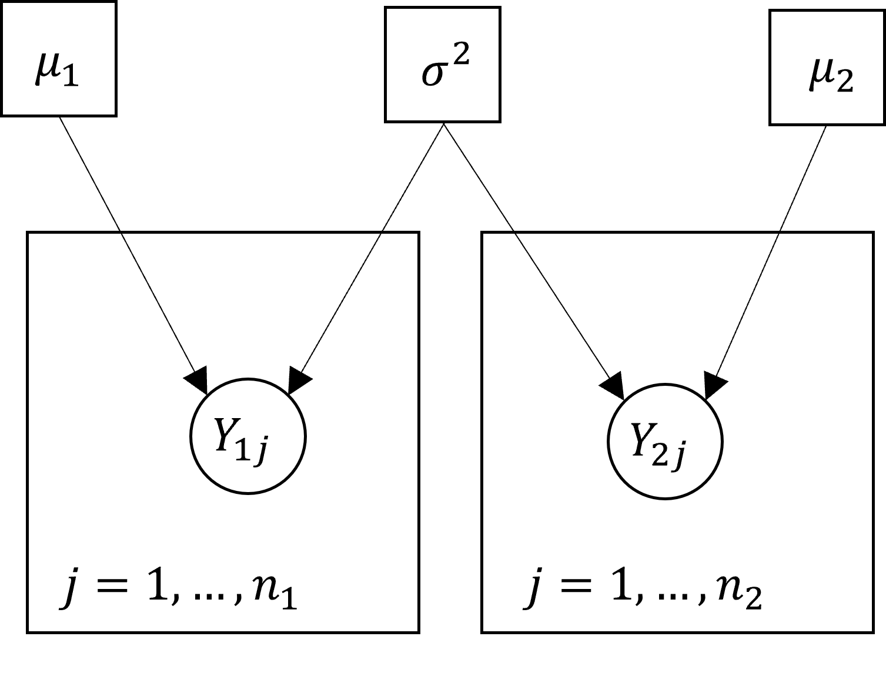
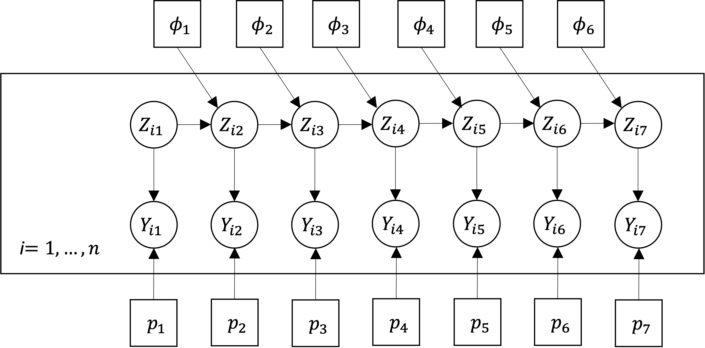
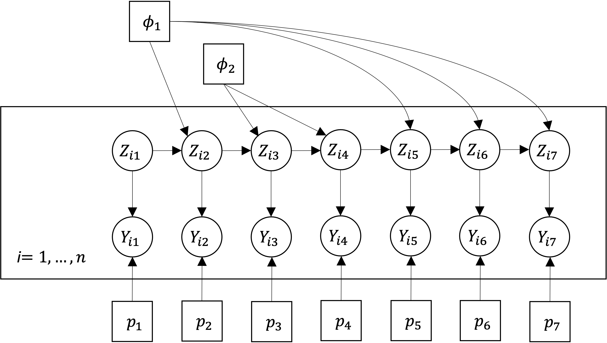

```{r setup, include=FALSE, purl = FALSE}
knitr::opts_chunk$set(echo = FALSE, 
                      eval = TRUE,
                      fig.align = "center")

## Load packages 
library(tidyverse)
library(knitr)
library(coda)
```

# Introduction to Bayesian Inference with JAGS for Ecologists {.tabset}

## Getting Started  {.tabset}

### Welcome!

Welcome to the workshop on Bayesian inference with JAGS for ecologists. The field of Bayesian inference is very extensive with applications in all areas of research. There are many excellent book on Bayesian statistics, and my goal is not to try to reproduce all of the content they contain. Instead, I am hoping to provide you with a first look at the subject includes some hands on examples using both R the JAGS software package. 

The workshop is designed to allow you to work at you own pace. The material is divided into a number of sections organized using the tabs at the top of the page. Each tab (except this one) has several subtabs. Working through the tabs in order will lead you through a series of explanations, examples, and exercise that will introduce you to the basic concepts of Bayesian statistics and programming with JAGS. The content at the end of the course will also introduce you to some of the core ideas of Markov chain Monte Carlo (MCMC). By the end of the workshop you should be able to:

- Construct the Directed Acyclic Graph (DAG) for a simple statistical model.
- Understand the connection between a DAG and JAGS code for the same model.
- Run a model in JAGS using the functions from the `rjags` package in R.
- Summarize the results of a model based on the output from JAGS.
- Explain the basic workings of MCMC. 

Please don't hesitate to ask any questions.

Simon

### Setting Up

#### Packages

You will need to have the `R` packages `coda`, `rjags`, and `ggmcmc` installed to run the code in this workshop. You can install these with the function `install.packages()` in the `R` console or using the `install` button from the `Packages` pane in `RStudio`. I suggest that you install these now so that you don't get hung up on this later. Let me know if you need any help with this.

#### Working directory

You will also need to set your working directory in `R` to the location of *this file* to access the files for the examples. You can set the working directory using the menu command `Session > Set Working Directory > Choose Directory...` in `RStudio`. Alternatively, you can use the command `setwd()` in the `R` console. 


## Introducing JAGS {.tabset}

### Introduction

We will begin by looking at JAGS and then see how the software can be used in the framework of Bayesian statistics. The core idea behind JAGS is that we can learn about a distribution by repeatedly sampling. 

Consider the problem of tossing a coin repeatedly and counting the number of times it lands heads side up, which I will call $Y$. There is statistical theory that tells us about the distribution of $Y$ -- if the coin is fair then $Y$ has a binomial distribution with parameters equal to the number of tosses and the probability of the coin landing heads side up, which should be .5. We could then use the theoretical distribution to calculate values like the mean (average) number of times the coin lands heads side up on 10 tosses or the probability that the coin lands heads side up on exactly 5 of 10 tosses.

However, you could also estimate these values by simulation. Using a physical simulation, you could repeatedly toss a coin 10 times in a row and count the number of times the coin lands heads side up on each trial. You could then estimate the mean number of times the coin lands heads side up by averaging the observed values. You could estimate the probability that the coin lands heads side up on exactly 5 of 10 tosses by the proportion of times this specific event occurs. 

A more efficient method of simulation is to do this on a computer. The following R code will simulate data for the coin tossing problem and estimate the values above:
```{r, eval = FALSE, echo = TRUE}
## Set parameters
n <- 10 # Number of tosses per trial
m <- 100 # Number of trials

## Simulate number of heads
Y <- rbinom(m, n, .5)

## Estimate the mean
mean(Y)

## Estimate the probability the coin lands heads side up 5 times
sum(Y == 5)/m
```
The true values are 5.0 and .25. Your results should be close to this, but they will not be exact. You will also get different answers if you repeat the simulation. However, if you increase the number of replicates (`m`), then the results will get closer and closer to the truth. Although there is always some level of variation, if `m` is big enough then the uncertainty will be small enough to ignore. 

At it's heart, JAGS is doing exactly this, but it is able to simulate from much more complicated distributions then we could work with easily in R. The name is an acronym that stands for "Just Another Gibbs Sampler", though Gibbs sampling is just is just one of the methods that it implements.  In general, the sampling methods fall into the class of Markov chain Monte Carlo or MCMC. Later sections will connect the problem of sampling to Bayesian inference and provide more details on MCMC. However, we'll start by looking at the basic syntax of JAGS, how JAGS can be connected with R, and how to generate simulated data from some simple statistical models. 

### Visualing Statistical Models

Much of the syntax for JAGS will look familiar if you have programmed in R before. However, what JAGS is doing is fundamentally different. R is a functional programming language meaning that it works by providing input to functions that then return output. Some functions may be very complicated, but they are all essentially black-boxes that take some numbers, do some calculations, and spit some new numbers out the other end. 

The purpose of the JAGS language is to define relationship between the variables in a statistical model. Behind the scenes, JAGS is constructing a graph that describes how the variables are connected. The variables are referred to as nodes in the graph, and the nodes belong to one of two types: deterministic or stochastic. A node is deterministic if the value of the node is unique given its inputs. For example, a node that adds to values is deterministic because it will always produce the same sum from the same input. A node is stochastic if its inputs define a distribution from which a value can be drawn. For example, a stochastic node might define a normal distribution which depends on its mean and variance. Each time the sampler is run JAGS will draw a value from the distribution at random, and so the value of the node will change even if the mean and variance supplied are the same. 

There are also some conditions which the final graph must satisfy. It must be directed and it must be acyclic. Directed simply means that there is a direction to each of the connections in the graph. Each node accepts input from some nodes and passes output on to other nodes. The nodes providing input are called parents and the nodes accepting output are called children. In the example of the normal distribution, the mean and variance are parents and the stochastic node is their child. Acyclic means that you can't ever get back to the same node by following connections in the correct direction. We say that the final graph is a Directed Acyclic Graph or DAG short.

#### Example 1: Two-Sample Problem

Consider the setup of a two-sample $t$-test. We assume that we have $10$ observations from one group and $15$ from a second group such that the observations are normally distributed with the same variance but possibly a different mean. I will let $Y_{ij}$ denote the $j$-th observation from group $i$, $\mu_i$ the mean for group $i$, and $\sigma^2$ the common variance. The DAG might be drawn like this:

{width=300px}

The square boxes around the parameters, $\mu_1$, $\sigma^2$, and $\mu_2$ indicate that these are deterministic nodes. The round boxes around $Y_{1j}$ and $Y_{2j}$ indicate that these are stochastic nodes. The arrows show the directions of dependency between pairs of nodes: $Y_{1j}$ depends on $\mu_1$ and $\sigma^2$ and similarly for $Y_{2j}$. Finally, the larger square boxes indicate that the structure inside is repeated, with the number of replications indicated in the bottom corner. E.g., the distribution of each $Y_{1j}$ is the same for all values of $j$ from 1 to $n$. 

#### Exercise 1: Linear Regression

The simple linear regression model relates the mean of a response to some predictor. Specifically, we assume that the the $i$-th observation, denoted by $Y_i$, follows a normal distribution whose mean, $\mu_i$, is a linear function of the predictor, $x_i$, given by $\mu_i = \beta_0 + \beta_1 x_i$. Here $\beta_0$ is the intercept and $\beta_1$ is the slope. The variance of the response is assumed to be a constant, usually denoted by $\sigma^2$. 

Construct the DAG for a simple linear regression model with $50$ observations. 

Jump to the [solution](#solution1). 

### Conditional Distributions

When you run JAGS you will usually supply values for some of the nodes in the graph. JAGS will then sample values for the remaining nodes in the graph. Specifically, JAGS samples from the conditional distributions of each of these nodes given the values you supplied for the remaining nodes. That is, it samples from the distribution of each unobserved node given the current values of both its parents and its children. 

#### Example 2: Craps
As an example of conditional distributions, suppose that we want to know the probability of rolling a 5 in craps -- a simple dice game in which players roll a pair of six sided die and bet on sum of the two values. The smallest possible outcome (the sum of the values on the two die) is 2 and the largest is 12. the probability of the different outcomes are given in the following table:
```{r}
## Craps probabilities
craps <- tibble(Outcome = as.integer(2:12),
                Probability = c(1,2,3,4,5,6,5,4,3,2,1)/36)

t(craps) %>%
  kable(digits = 3)
```
Now suppose that you know that the value on the first die is 3. There is only one value for the second die that will produce the outcome 5, it's 2, and so the probability of rolling a 5 given that the value on the first die is 3 is 1/6=.167. We say that the marginal probability of the outcome 5 is .111 and the conditional probability of the outcome 5 *given that the value on the first die is 3* is .167. In this case, the conditional probability is higher than the marginal probability. 

We could also ask about the conditional probability for the values of the two die together given that the outcome (their sum) is 5. There are four different configurations of the two die that produce the outcome 5: 1 and 4, 2 and 3, 3 and 2, and 4 and 1. Hence, the probability of each of these configurations given that the sum is 5 is 1/4=.25. 

In this case, it is very simple to construct these conditional distributions. However, if the distribution is complex then it can be very difficult to derive the conditional distributions mathematically. JAGS essentially solves this problem by simulating from the conditional distributions numerically rather than trying to derive mathematical formulas.  

#### Exercise 2: Dominant and Recessive Traits

The classic genetics problem assumes that there is a single gene for eye colour with two alleles: a dominant allele B that produces brown eyes and a recessive allele b that produces blue eyes. An individual has brown eyes if they have genotype BB or Bb and blue eyes if they have genotype bb. 

Suppose that a population of 100 individuals contains 25 individuals with genotype BB, 50 individuals with genotype Bb, and 25 individual with genotype bb. 

1) What is the probability that a randomly selected individual has at least one copy of the recessive allele?

2) What is the probability that a randomly selected individual has at least one copy of the recessive allele give that they have brown eyes?

### Basic JAGS syntax

#### Example 1 (continued): Two-Sample Problem

To introduce some of the basic JAGS notation we will look at the code to implement the two-sample setup of Example 1. The code is contained in the file `Examples/Example_1/example_1.jags` and looks like this:
```{r, eval=FALSE, echo = TRUE}
model{
  # Parameters  
  mu1 <- 5
  mu2 <- 10
  sigmasq <- 2
  
  # Distributions
  for(j in 1:10){
    y1[j] ~ dnorm(mu1,1/sigmasq)
  }
  
  for(j in 1:15){
    y2[j] ~ dnorm(mu2,1/sigmasq)
  }
}
```
Let's break this down.

First, the code must be enclosed in a block of text with `model{` at the top of the file and `}`. This may seem a little odd. However, JAGS also allows a second block enclosed by `data{...}` that defines data manipulations that are to be run before the model is run. We will do all of our data manipulations in `R` so we won't need the second block, but you still need to enclose the code with `model{...}` so JAGS knows where to look.

Each node is defined by a statement of the form `variable ~ definition` or `variable <- definition`. The first form defines a stochastic node and the second defines a deterministic node. In this case, `mu1`, `mu2`, and `sigmasq` represent the values $\mu_1$, $\mu_2$, and $\sigma^2$ and are defined as stochastic nodes. I have given them specific values to make the code complete. On the other hand, $y1[j]$ and $y2[j]$ representing $Y_{1j}$ and $Y_{2j}$ are defined as stochastic nodes. The function `dnorm()` indicates that they are assigned normal distributions, and the function requires two arguments to complete their definitions: their respective means and their precisions (which is the reciprocal of the variance). 

The lines beginning with the hash symbol (`#`) are comments, just as in `R`. These are ignored by JAGS and have no effect on the output. 

The square brackets around `j` in the definition of `y1` and `y2` indicate that these nodes form one-dimensional arrays (i.e. vectors) that are indexed by the value of `j`. Arrays of any size can be constructed by adding more indices separated by commas. For example, `X1[i,j]` would define `X1` to be a two-dimensional array (a matrix) indexed by `i` and `j`, `X2[i,j,k]` would define `X2` to be a three-dimensional array indexed by `i`, `j`, and `k`, etc. In most cases, JAGS will infer the size of an array from the rest of the code so you do not need to define this explicitly. 

Finally, the lines
```{r,echo=TRUE,eval=FALSE}
for(j in 1:10){
  y1[j] ~ dnorm(mu1,1/sigmasq)
}
```
create a for loop which defines the repeated structure for the 10 observations from the first group which all have the same distribution. This is not the same as a for loop in `R` which performs sequential calculations. Instead, it is just a convenient way to implement the same structure repeatedly. The model could also have been written with the lines
```{r,echo=TRUE,eval=FALSE}
y1[1] ~ dnorm(mu1,1/sigmasq)
y1[2] ~ dnorm(mu1,1/sigmasq)
y1[3] ~ dnorm(mu1,1/sigmasq)
y1[4] ~ dnorm(mu1,1/sigmasq)
y1[5] ~ dnorm(mu1,1/sigmasq)
y1[6] ~ dnorm(mu1,1/sigmasq)
y1[7] ~ dnorm(mu1,1/sigmasq)
y1[8] ~ dnorm(mu1,1/sigmasq)
y1[9] ~ dnorm(mu1,1/sigmasq)
y1[10] ~ dnorm(mu1,1/sigmasq)
```
instead, but that is awfully tedious. 

### Running JAGS from R

#### rjags

There are several packages that allow you to connect `R` and JAGS. This allows you to process your data in `R` and then to easily retrieve the output from JAGS to summarize the results of your analysis. We'll make use of the `rjags` package. The two main functions we will use from the package are `jags.model()` which initializes the model and `coda.sample()` which runs the model to generate samples from the conditional distributions of the unobserved nodes.

#### `jags.model()`

The function `jags.model()` compiles the model and adapts the sampler (which we will discuss later in the section on Markov chain Monte Carlo). The key arguments of the function are:

- `file`: the name of the file containing a description of the model in the JAGS dialect of the BUGS language.
- `data`: a list or environment containing the data. Any numeric objects in data corresponding to node arrays used in file are taken to represent the values of observed nodes in the model.

#### `coda.samples`()

The function `coda.samples()` runs the model to generate samples from the conditional distributions of the unobserved nodes. The key arguments for this function are:

- `model`: a JAGS model object created with the function `jags.model()`.
- `variable.names`: a character vector naming the variables whose values you want returned. 
- `n.iter`: the number of samples to generate (i.e., the number of iterations)

#### Example 1 (continued): Two-Sample Problem

The following code will compile the model for the two-sample problem and then generate 100 samples from the 25 unobserved variables. Note that you only need to load the `rjags` package once in each `R` session. If you have not installed the package then `Rstudio` should prompt you to do so. You will also have to set the working directory for `R` to the location where *this file* is stored to run the example. The easiest way to do this is to open the file in `Rstudio` and then select `Session > Set Working Directory > Choose Directory...` from the menus and then navigate to the correct directory.

```{r, echo = TRUE, eval = FALSE}
# Load rjags
library(rjags)

# Initialize model
jags_model_1 <- jags.model("Examples/Example_1/example_1.jags")

# Generate samples
jags_samples_1 <- coda.samples(jags_model_1, c("y1","y2"), n.iter = 100)
```
Run this code in `R`. If the model runs properly then you should see the following output. 
```{r, echo = TRUE, eval = FALSE}
Compiling model graph
   Resolving undeclared variables
   Allocating nodes
Graph information:
   Observed stochastic nodes: 0
   Unobserved stochastic nodes: 25
   Total graph size: 30

Initializing model

  |**************************************************| 100%
```

#### coda

The `coda` package contains functions to summarize the samples generated by JAGS. Here will use the `summary()` function to generate sample statistics for each of the monitored variables. The output from the this function contains 3 pieces. The first provides basic information the running of the sampler, including the number of samples that were generated. The second lists the mean and standard deviation for each variables, along with two further statistics which we will discuss later. The third provides estimates of the quantiles for each variable. The column values in the column labelled `X%` represent the `X`-th percentile of the distribution for that variable -- the value which is greater than exactly `X`% percent of the samples. The 50-th percentile is the median of the distribution.

#### Example 1 (continued): Two-Sample Problem
```{r, echo = FALSE, eval = TRUE}
## Load saved output
jags_model_1 <- readRDS("Output/example_1_jags_model.rds")
jags_samples_1 <- readRDS("Output/example_1_jags_samples.rds")
```

The following code loads the `coda` package and then summarizes the results from the previous model. Remember that you only need to load the package once each time you run `R`.
```{r, eval = FALSE, echo = TRUE}
## Load coda package
library(coda)

## Compute summaries
summary(jags_samples_1)
```
For this simple model, we can compute the exact values for these statistics. The true mean and standard deviation for each `y1[j]` are 5 and $\sqrt{2}=1.414$. The true percentiles are 2.228, 4.046, 5.000, 5.954, and 7.772. The true mean and standard devitation for each `y2[j]` are 10 and $\sqrt{2}=1.414$. The true percentiles are 7.228, 9.046, 10.000, 10.954, and 12.772. You should see that the values reported are close to the values, but not exactly equal. The reason is that they are computed from a sample which is subject to variation. Each time you run JAGS you will get slightly different output. However, as you increase the number of iterations, the values you see in the summary output should get closer and closer to the truth. 

We can also look at the summary information graphically using the functions in the `ggmcmc` package. Install the package, and run the following code to create a caterpillar plot visualizing the summary statistics for each sampled value:
```{r}
## Load package
library(ggmcmc)

## Construct ggs object
ggs_1 <- ggs(jags_samples_1)

## Create caterpillar plot
ggs_caterpillar(ggs_1, sort = FALSE)
```
For each of the sampled values, labelled on the left side, the point represents the posterior mean, the thick bar represents the extents of the 50% interval formed by the 25 and 75%-iles, and the thin bar represents the extents of the 95% interval formed by the 2.5 and 97.5%-iles. This plot very clearly shows the difference between the two groups. All of the sampled means for the first group are near 5 and all of the sampled means for the second group are near 10.

#### Passing Data to JAGS

In most cases, you will want to pass data from `R` into JAGS. For example, the values of `mu1`, `mu2`, and `sigmasq` are coded into the model in our current implementation of the two-sample problem. This means that you need to edit the code if you want to generate a new sample with different values of these parameters.

An easier way to do this is to pass the values of these parameters from `R` into JAGS instead of assigning values to these parameters within the JAGS model file. This is done using the `data` argument of the `jags.model()` function. The value supplied to this argument must be a named list. JAGS will then read these values before it runs the sampler.

#### Example 1 (continued): Two-Sample Problem
The file `Examples/Example_1/example_1b.jags` reproduces the code for the two-sample problem, except that it excludes the lines that define the values of `mu1`, `mu2`, and `sigma2`. 

The following code reruns the model from `R`. However, it includes code to construct the list `jags_data_1b` which defines the values of the parameters and then passes this to the function `jags.model()`.  
```{r, echo = TRUE, eval = FALSE}
# Construct data list
jags_data_1b <- list(mu1 = 5, mu2 = 10, sigmasq = 2)

# Initialize model
jags_model_1b <- jags.model("Examples/Example_1/example_1b.jags", jags_data_1b)

# Generate samples
jags_samples_1b <- coda.samples(jags_model_1b, c("y1","y2"), n.iter = 100)
```

## Bayesian Statistics {.tabset}

### Introduction
So far, we have used JAGS to generate data from a model given set values for the parameters. The aim of statistical inference turns this around: we aim to learn about the values of the parameters based on a given set of data. We do this in Bayesian inference by constructing distributions that model our uncertainty in the values of the parameters conditional on the data. If the models are simple enough then we can describe these distributions mathematically. However, this is rarely possible in practice. Instead, we can use JAGS, or similar software, to simulate from the distributions of the parameters conditional on the observed data.

### Prior and Posterior Distributions

There is one final ingredient that needs to be defined before we can conduct inference using JAGS -- the prior distribution. The mathematics of probability implies that we must assign an initial distribution to each of the parameters in the model in order to construct its conditional distribution given the data. This distribution is called the prior distribution. It encodes our uncertainty about the parameter before data are observed (*a priori* in Latin). The conditional distribution that results from the combination of this distribution and the data is called the posterior distribution. It encodes our uncertainty about the parameter after the data are observed (*a posteriori*). 

There are different ways of constructing prior distributions that have different effects on the posterior. Some of the debate can be rather philosophical, and we will avoid this during this workshop. Instead, we will look at common prior distributions and the effects they have on inference.

#### Example 3: Coin Tossing

Suppose that your friend has two coins, one of which is fair (i.e., it has a heads side and a tails side and lands heads side up 50% of the time) and one of which has heads on both sides (so it always lands heads side up). You close your eyes, pick one of the coins at random, and hand it to him. He will then toss it and tell you whether it lands heads or tails side up. Your job is to decide whether you have chosen the fair code or the coin with two heads.

If you pick the coin at random then there is a 50% chance that you choose either coin. A priori, the probability that you chose the fair coin is .5 and the probability that you chose the coin with two heads is .5. This is the prior distribution. If he tosses the coin and it lands heads side up then it must be the fair coin. In this case, the posterior distribution puts probability 1 on the fair coin and probability 0 on the coin with two heads (and your job is easy). 

What happens if the coin lands heads side up? It's possible to show in this case that the posterior distribution assigns a probability of 1/3 that the coin is the fair coin is and a probability of 2/3 that it is the coin with two heads.

What happens if your friend tosses the same coin a second time and it lands heads side up again? In this case, the posterior probability that it is the fair coin is 1/5 and the probability that it is the coin with two heads is 4/5. More generally, if your friend tosses the coin $n$ times and it lands heads side up every time then the posterior distribution assigns probability $1/2^k$ that you chose the fair coin and probability $1-1/2^k$ that you chose the coin with two heads. 

### Interpreting Posterior Distributions

In Bayesian inference, information about the parameters is contained in the posterior distribution. Consider the coin tossing problem. Initially, the prior distribution assigns equal probability to the fair coin and the coin with two heads. After the coin lands heads side up once, the posterior distribution assigns probability of $2/3$ to the coin with two heads. There is still a 1/3 chance that it is the fair coin, but it is more likely to be the coin with two heads. After the coin and heads side up twice, the probability assigned to the coin with two heads increases to 4/5. As the coin is tossed more and more and lands heads side up more and more often you become more and more certain that you chose the coin with two heads. There is always a possibility that you picked the fair coin and it happened to land heads side up every time by chance, but this becomes less and less likely the more the coin is tossed. If the coin lands heads side up 10 times in a row then the posterior distribution assigns probability $1-1/2^10=.9990234$ to the coin with two heads. This is so unlikely to happen if the coin is fair, that the posterior distribution assigns a probability on only $.000976$ to the fair coin (less than 1 in 10,000). 

In most cases, the distributions we assign to parameters will be continuous not discrete. For example, prior distributions are often selected to be normal distributions. In these cases, we summarize information about the parameters using the basic statistics for describing the shape of a distribution that you have likelihood encountered in introductory statistics classes. These include the mean, median, and mode to identify the centre (location) of the distribution and the standard deviation to measure the spread of the distribution. 

A more informative summary of a distribution that measures both its location and its spread is an interval that contains a certain amount of the distribution's probability. An interval that contains $X$% of the probability under the posterior distribution for a parameter is called an $X$% credible interval. For example, the interval between the 2.5 percentile and 97.5 percentile contains 95% of the probability and hence forms a 95% credible interval. Credible intervals are the Bayesian analogue of confidence intervals in classical statistics. 

In practice, it is common to provided one of the measures of location of the posterior distribution (most of the mean) as a point estimate (the best guess at the value of a parameter) and either the standard deviation or a credible interval as a measure of the spread. Bigger values of the standard deviation or wider credible intervals indicate that there is more uncertainty about the value of the parameter (the posterior distribution is more spread out). Smaller values of the standard deviation or narrower credible intervals indicate that there is less uncertainty about the value of the parameter (the posterior distribution is less spread out). 

#### Example 4: Coin Tossing 2

Consider the coin tossing problem again, but suppose this time that your friend only has one coin which has both a heads and a tails side. However, it is not fair and lands heads side up with some probability between 0 and 1, which I'll call $p$, and tails side up with probability $1-p$. E.g., if $p=.1$ then it lands heads side up on 1 out of every 10 tosses, on average, and if $p=.9$ then it lands heads side up on 9 out of every 10 tosses, on average. Your job this time is guess the value of $p$. 

You might choose a prior distribution in this case that assigns the same probability to every value between 0 and 1. This is the uniform distribution. Suppose that your friend tosses the coin $n$ times and it lands heads side up $k$ times. In this case, it's possible to compute the posterior distribution exactly. The plots below compare the posterior distribution for two different values of $n$, 5 and 10, and two different values of $k/n$, .2 (meaning that $k$ is equal to 1 if $n=5$ and 2 if $n=10$) and .8 (meaning that $k$ is equal to 4 if $n=5$ and $8$ if $k=10$). 
```{r, echo = FALSE, eval = TRUE}
mydata <- crossing(n = c(5,10),
                   r = c(.2,.8),
                   p = (1:100)/101) %>%
  mutate(k = r * n,
         d = dbeta(p, k + 1, n - k + 1))

mydata %>%
  ggplot(aes(x = p, y = d)) + 
  geom_line() + 
  facet_grid(n ~ r) +
  geom_vline(aes(xintercept = r), lty = 2) +
  ylab("Posterior Distribution")
  
```

In each case, the posterior distribution is highest around the value $k/n$, which is shown by the dotted line. This indicates that $k/n$ is the best guess at the probability of tossing a head given the observed data. However, the posterior distribution becomes narrower as $n$ increases, meaning that we become more certain of the probability as we toss the coin more and collect more data. 

This is also evident in the following table which provides the posterior means and the lower and upper bounds of the 95% credible intervals for $p$ for each combination of $n$ and $k$. The posterior mean only depends on the ratio $k/n$, but the confidence interval becomes narrower as $n$ increases. 
```{r}
mytab <- crossing(n = c(5,20),
                  r = c(.2,.8)) %>%
  mutate(k = n * r,
         Mean = r,
         Lower = qbeta(.025,k + 1, n - k + 1),
         Upper = qbeta(.975, k+1, n - k + 1))

mytab %>%
  select(-r) %>%
  kable(digits = 2)
```

#### Example 4 (continued): Coin Tossing 2

The number of heads in our coin toss example follows a binomial distribution with parameters $n$ and $p$. This is a very simple model, and the DAG looks like this

{width=150px}

This binomial distribution is implemented with the function `dbinom(p,n)` in JAGS (yes, the `n` and the `p` are backwards). The uniform distribution over the interval from 0 to 1 is implemented with the function `dunif()`. Putting these together, we can implement the model with the code
```{r, eval = FALSE, echo = TRUE}
model{
  ## Distribution of observed data
  k ~ dbinom(p,n)
  
  ## Prior distribution
  p ~ dunif(0,1)
}
```
This code is also provided in the file `Examples/Example_4/example_4.jags`. The following `R` code would compile this model and then generate 1000 samples from the distribution of `p` for the case in which the coin is tossed 10 times and lands heads side up 4 times. 
```{r, eval = FALSE, echo = TRUE}
## Define data
jags_data_4 <- list(n = 10, k = 4)

## Compile model
jags_model_4 <- jags.model("Examples/Example_4/example_4.jags", jags_data_4)

## Generate samples
jags_samples_4 <- coda.samples(jags_model_4, "p", n.iter = 1000)

## Compute summary statistics
summary(jags_samples_4)
```
Run the code and compare the mean and 95% credible interval from the sample with the theoretical mean and 95% credible interval given above. You should find that the results are close but not exact. Try running the code again and increase the number of sample drawn from the posterior distribution from 1000 to 5000 or 10000. You should find that the results become closer and closer to the theoretical value as the number of samples generated increases.  

## Ecological Models {.tabset}

### Introduction

We will look at versions of three different models to illustrate the application of Bayesian inference in the analysis of ecological data. First, we will consider a simple closed population model. Then we will look at an implementation of the Cormack-Jolly-Seber (CJS) model for open populations, and finally we will consider a multi-state version of the CJS model.

### Closed Population Models

<center>

{width=500px}

</center>

#### Two-Sample Experiment

The simplest mark-recapture study is one in which individuals are captured on only two occasions. A sample of individuals are captured on the first occasion, marked, and returned to the population. A second sample is then taken after allowing sufficient time for the marked individuals to mix back into the population (but not so long that individuals can enter or leave the population). This sample will contain both marked and unmarked individuals, and we can use the ratio of marked and unmarked individual to estimate the size of the population.

Let $n_1$ denote the number of individuals captured and marked in the first sample, $n_2$ the number of unmarked individuals captured in the second sample (i.e., the number in the second sample that were not captured in the first sample), $m$ the number of individuals captured in both, and $N$ the unknown population size. One way to estimate the population size is to assume that the proportion of marked individuals captured in the second sample is the same as the proportion of marked individuals in the entire population:
$$
\frac{m}{n_1 + n_2}=\frac{n_1}{N}.
$$
Solving this equation for $N$ provides the estimator
$$
\hat{N}_{LP} = \frac{n_1(m + n_2)}{m}
$$
This is commonly known as the Lincoln-Petersen estimator (hence the subscript LP). An alternative estimator that has better statistical properties is the Chapman estimator
$$
\hat{N}_{C}=\frac{(n_1+1)(m + n_2+1)}{(m+1)} - 1.
$$
To implement this model in the Bayesian frawework we need to describe the distributions of the observed data and then assign prior distributions to the unknown parameters. If we assume that all individuals in the population have the same probability of capture, which I will denote by $p$, then $m$ follows a binomial distribution with parameters $n_1$ and $p$ and $n_2$ follows a binomial distribution with parameters $N-n_1$ and $p$. I will let $N_0=N-n_1$ denote the number of individuals in the population that were not captured and marked in the first sample. The DAG for this model looks like this:

{width=300px}


As noted before, the binomial distribution is implemented in JAGS with the function `dbinom()` and so the data portion of the model would look like this:
```{r echo=TRUE,eval=FALSE}
  # Data distribution
  m ~ dbinom(p,n1)
  n2 ~ dbinom(p,N0)
```
Unless we have previous information about the capture probability, we might it a uniform prior from 0 to 1 to indicate that it is equally likely to take any value in its range. The population size has to be an integer, and so we need to be a little careful about how we assign the prior for $N$. One possibility is to assign $N$ a prior distribution that places equal weight on the integers from 1 up to some large number that is known to be much larger than the true value of $N$, which I will call `Nmax`. This can be implemented with the function `dcat()`. The portion of the code defining these prior distributions would look like this:
```{r eval=FALSE, echo=TRUE}
  # Prior distributions
  p ~ dunif(0,1)
  N0 ~ dcat(pN0)
```
Here `pN` is a vector of 1s of length `Nmax`, meaning that the values from 1 up to `Nmax` are equally likely (any repeated value would produce the same results).

Putting this together, the full model is given by:
```{r eval=FALSE, echo=TRUE}
model{
  # Data distribution
  m ~ dbinom(p,n1)
  n2 ~ dbinom(p,N0)
  
  # Prior distributions
  p ~ dunif(0,1)
  N0 ~ dcat(pN0)
}
```

Unfortunately, there is a problem with this model and it won't run in JAGS. The problem is that JAGS, and other MCMC samplers, require that the number of trials in a binomial is known. In our model, the number of trials in the distribution of $n_2$, $N_0$, is not known and so the model won't run. There are a couple of ways to solve this problem. The simplest is to use the fact that if the number of trials is large then a binomial distribution with parameters $n$ and $p$ can be approximated by a Poisson distribution with mean $np$ (I don't expect you to know this, though you may have seen this before if you have taken a course in probability). The new model becomes:
```{r eval=FALSE, echo=TRUE}
model{
  # Data distribution
  m ~ dbinom(p,n1)
  n2 ~ dpois(p * N0)
  
  # Prior distributions
  p ~ dunif(0,1)
  N0 ~ dcat(pN0)
  
  # Derived variables
  N <- n1 + N0
}
```
As a caveat, this solution only works when the population size is large. There is another solution that works in all cases, which I'll talk about below. I have also added a line of code to compute the total population size as a derived variable, $N=n_1 + N_0$. The code for this model is provided in the file `Examples/Example_5/example_5a.jags`.

##### Example 5: Snowshoe Hares (Two-Samples)

As an example, we will analyse data from a study of snowshoe hares. Hares were sampled from the population on 6 different occasions, but we will focus just on the first two samples for now. A total of $n_1=16$ hares were captured and marked in the first sample of which $m=4$ were recaptured in the second sample. The second sample also contained a further $n_2=24$ unmarked hares. The LP estimate for the population size given these values is 112 (after rounding) and the Chapman estimate is 98.

The model can be run in JAGS with the following code:
```{r echo=TRUE, eval=FALSE}
## Construct JAGS data
jags_data_5a <- list(n1 = 16, n2 = 24, m = 4, pN0 = rep(1,1000))
  
## Compile model
jags_model_5a <- jags.model("Examples/Example_5/example_5a.jags", jags_data_5a)

## Generate samples
jags_samples_5a <- coda.samples(jags_model_5a, c("p","N"), n.iter = 1000)

## Compute summary statistics
summary(jags_samples_5a)
```
You should find that the posterior mean for $N$ is about 145 and that the 95% credible interval extends from about 70 to 321. Again, your exact results may differ somewhat because of random variations in the sampling. 

Once again, we can visualize the summary statistics with a caterpillar plot:
```{r, echo=TRUE, eval=FALSE}
## Create ggs object
ggs_5a <- ggs(jags_samples_5a)

## Draw caterpillar plot
ggs_caterpillar(ggs_5a)
```
In this case, the two parameters are on very different scales. This makes it impossible to visualize the summary statistics together. Instead, we can separate the plots with the following code:
```{r echo = TRUE, eval=FALSE}
## Draw caterpillar plot for N
ggs_caterpillar(ggs_5a, "N")

## Draw caterpillar plot for p
ggs_caterpillar(ggs_5a, "p")
```

#### More than Two Samples -- Constant $p$

Suppose now that more than two samples are taken from the population. Each time a sample is taken we record the identities of any individuals that were captured and marked in a previous sample, mark any newly captured individuals, and return all of the individuals back into the population. The times when the samples are taken are called the capture occasions. The data from this experiment can be recorded in the form of a capture history for each individual -- a string of 0s and 1s indicating on which occasions the individual was captured. For example, if an experiment had 5 capture occasions then the history 10101 would indicate that the individual was captured on three occasion -- the first (when it was marked), the third, and the fifth. 

We'll start by assuming that the capture probability is the same on all occasions, and again denote this with $p$. This is often referred to as having constant $p$. In this case, the probability that an individual is captured at least once is $p_\mbox{ever}=1-(1-p)^K$ where $K$ represents the number of capture occasion. The number of individuals captured at least once during the experiment then follows a binomial distribution with parameters $N$ and $p_\mbox{ever}$. Moreover, the capture histories for the captured individuals form a sequence of Bernoulli trials (binomials of size one) with probability $p$. 

##### Example 6: Snowshoe Hares (Full Data)

To illustrate the model with more than two samples we will analyse the full snowshoe hare data set. The data is provided in the file `Examples/Example_6/snowshoe_hare.csv`. Each row in the data set represents the capture history for 1 individual. For example, the capture history of the first individual is 111111 indicating that it was captured on all 6 occasions while the capture history for the 10th individual is 100100 indicating that it was captured only on the 1st and 4th occasions. A total of 68 hares were captured at least one time.

The JAGS code to fit the model data is in the file `Examples/Example_6/example_6a.jags`. The way I have implemented this model uses a process called data augmentation to estimate the population size. The idea is that we embed the observed animals inside a large population of hypothetical animals that may or may not be part of the actual population. Along with the capture histories of the 68 marked individuals, we include a large number of capture histories of all 0s representing the potential individuals that might have gone undetected. Each individual is also assigned a variable, called `alive`, that determines whether or not it is actually part of the population. Marked individuals must be alive because they were captured. Each of the added individuals has the potential to be alive or not, and the total population size is equal to the number of alive individuals. 

The following code will fit the model and generate summary statistics. I have chosen to add 1000 extra unobserved individuals to the population, represented by the value `M` in the code below. The value is somewhat arbitrary and will not affect the results, provided that it is big enough. 
```{r, echo=TRUE,eval=FALSE}
## Load data
hare <- read_csv("Examples/Example_6/snowshoe_hare.csv")

## Construct JAGS data
jags_data_6 <- list(n = 68,
                    M = 1000, 
                    K = 6, 
                    alive = rep(c(1,NA),c(68,1000)),
                    caps = rbind(as.matrix(hare),matrix(0,1000,6)))

## Compile model
jags_model_6a <- jags.model("Examples/Example_6/example_6a.jags", jags_data_6)

## Generate samples
jags_samples_6a <- coda.samples(jags_model_6a, c("p","N"), n.iter = 1000)

## Compute summary statistics
summary(jags_samples_6a)
```
You should find that the posterior mean of $N$ is about 75 and that the 95% credible interval extends from about 70 to 83. 

#### More than Two Samples -- Time-Varying $p$

There are many reasons that the capture probability might change across the capture occasions. Perhaps the capture of individuals depends on weather conditions. In this case, we might want the model to allow the capture probability to change over time. The code for this model is provided in `Examples\Example_6\example_6b.jags`. 

##### Example 6 (continued): Snowshoe Hares (Full Data)
The following code will fit the model with time-varying capture probabilities to the snowshoe hare data. Note that you do not need to recreate the data object:
```{r, echo=TRUE,eval=FALSE}
## Compile model
jags_model_6b <- jags.model("Examples/Example_6/example_6b.jags", jags_data_6)

## Generate samples
jags_samples_6b <- coda.samples(jags_model_6b, c("p","N"), n.iter = 1000)

## Compute summary statistics
summary(jags_samples_6b)
```

We can also visualize this summary statistics. In this case, $p$ and $N$ are on very different scales. If we plot them both on the same axes then the plotting symbols for the summary statistics of $p$ all lie on top of each other. To avoid this, we can separate the plots for $N$ and $p$:
```{r echo=TRUE, eval=FALSE}
## Create ggs object
ggs_6b <- ggs(jags_samples_6b)

## Draw caterpillar plot for N
ggs_caterpillar(ggs_6b, "N", sort = FALSE)

## Draw caterpillar plot for p
ggs_caterpillar(ggs_6b, "p", sort = FALSE)
```

#### More than Two Samples -- Hierarchical $p$

The constant $p$ and time-varying $p$ models represent two ends of the spectrum. In one case, we assume that the capture probability is exactly the same on each occasion. In the other, we let the capture probabilities vary completely separately from one another. However, the truth is likely to be somewhere in between. Even if the capture probabilities are not identical, if you capture individuals from the same population in the same way then the capture probabilities are likely to be similar. E.g., if the probability of capturing an individual on the first occasion is .1 then it seems unlikely that the probability will jump to .9 on the next occasion.

This situation can be described with a hierarchical model. A hierarchical model is constructed by assigning parameters a common prior distribution, but allowing the parameters of this prior distribution to be unknown and assigned a further prior distribution (sometimes called the hyperprior). 

An appropriate prior distribution to create a hierarchy for the capture probabilities is the beta distribution. Like the uniform distribution, the beta distribution is confined to the interval from 0 to 1, so it is appropriate for modelling probabilities. The beta distribution has two parameters, commonly labelled $\alpha$ and $\beta$. The mean is $\alpha/(\alpha + \beta)$ and the variance is
$$
\frac{\alpha\beta}{(\alpha + \beta)^2(\alpha + \beta + 1)}.
$$
Setting $\alpha=\beta=1$ recreates the uniform distribution. As $\alpha$ and $\beta$ increase the distribution becomes more concentrated around a single peak. Some examples are shown below for each combination of the values $\alpha = 2,8$ and $\beta = 2,8$.

```{r eval=TRUE, echo=FALSE}
mydata <- crossing(alpha = c(2,8),
                   beta = c(2,8),
                   p = seq(0,1,length = 101)) %>%
  mutate(Probability = dbeta(p,alpha,beta))

mydata %>%
  ggplot(aes(x = p, y = Probability)) +
  geom_line() + 
  facet_grid(alpha ~ beta) + 
  ylab("Probability Density")
```

The JAGS code to fit the closed population model with the hierarchical beta prior distribution is provided in `Examples/Example_6/example_6_c.jags`.

##### Example 6 (continued): Snowshoe Hares (Full Data) 

The following code will fit the closed population model with the hierarchical prior distribution to the snowshoe hare data:
```{r, echo=TRUE,eval=FALSE}
## Compile model
jags_model_6c <- jags.model("Examples/Example_6/example_6c.jags", jags_data_6)

## Generate samples
jags_samples_6c <- coda.samples(jags_model_6c, c("p","alpha","beta","N"), n.iter = 1000)

## Compute summary statistics
summary(jags_samples_6c)
```
The following code creates the caterpillar plot to visualize the summary statistics for the individual capture probabilities:
```{r echo=TRUE, eval=FALSE}
## Create ggs object
ggs_6c <- ggs(jags_samples_6c)

## Draw caterpillar plot for p
ggs_caterpillar(ggs_6c, "^p", sort = FALSE)
```

Fitting a hierarchical model has several advantages. First, it can improve our estimates of the individual capture probabilities. It will be hard to see in this case, but the estimates of the capture probabilities from the hierarchical model are slightly closer to each other than the estimates from the fully time-varying model. This process is called shrinkage and we say that the capture probabilities have been shrunk back toward their mean. In essence, the hierarchical model provides a midpoint between the contstant $p$ and time-varying $p$ models and lets the data decide how much variation there should be.

The hierarchical model also allows us to describe the distribution of capture probabilities over all possible samples, rather than focusing on the 6 samples in the data, and to predict what the capture probability might be in future samples. The estimates of `alpha` and `beta` (their posterior means) from my run of the model were are about 5.6 and 11.8. Given these values, we could say that the mean capture probability is $5.6/(5.6 + 11.8)=.32$. Using the function `qbeta()` in `R` we could compute the quantiles of the distribution:
```{r, eval = TRUE, echo = TRUE}
## Compute the 2.5% and 97.5%-iles of the distribution of p
qbeta(c(.025,.975), 5.6, 11.8)
```
If we were to collect another sample then we would guess that the capture probability would be about .31 and we could be 95% certain that it would be between about .13 and .55. You can replace the values 6.2 and 13.8 with the values from your summary to obtain specific results. 

### Open Populations

<center>

{width=500px}

</center>

A population is said to be open if individual can enter (by birth or immigration) or leave (by death or emigration) during the course of the experiment. Open populations are more difficult to work with because we need to model the dynamics of the population as well as the capture of individuals on the different occasions.

#### Cormack-Jolly-Seber Model

The basis for all mark-recapture models of dat from studies of open populations is the Cormack-Jolly-Seber or CJS model. The CJS model is based on the following assumptions about how individuals behave and how individuals are captured:

- Survival
    1. All individuals alive on one occasion have the same probability of survival to the next occasion (commonly denoted by $\phi_t$).
    2. Whether or not one individual survives from one occasion to the next occasion is not affected by its past survival or the survival of other individuals.
        
- Capture
    1. All individuals alive on one occasion have the same probability of being captured (commonly denotedy by $p_t$). 
    2. Whether or not one individual is captured on one occasion is not affected by whether it was captured on any past occasions or by the capture of other individuals. 
        
##### Example 7: Dippers

As an example, we will look at a data on the European dipper collected in France and originally described by Lebreton et al. (1992). The data contain records on the capture of 254 dippers over 7 occasions. 

#### Latent Variables

One of the things that makes Bayesian inference and MCMC sampling so powerful are the ease with which they handle what are called latent variables. Latent variables are extra variables that can be added to a model to describe the state of an individual or a population, but that cannot be observed. 

Consider the assumptions of the CJS model listed above. Both the survival and capture of individuals are defined conditional on being alive. Let $Z_{i,t}$ by an indicator variable so that $Z_{i,t}=1$ in individual $i$ is alive on occasion $t$ and $Z_{i,t}=0$ if the individual is not alive, and let $Y_{i,t}=1$ if individual $i$ is captured on occasion $t$ and $Y_{i,t}=0$ if it is not captured on occasion $t$. The first assumption about survival implies that the probability that $Z_{i,2}=1$ given that $Z_{i,1}=1$ is equal to $\phi_1$, the probability that $Z_{i,3}=1$ given that $Z_{i,2}=1$ is equal to $\phi_2$, etc. The first assumption about capture implies that the probability that $Y_{i,1}=1$ given that $Z_{i,1}=1$ is equal to $p_1$, the probability that $Y_{i,2}=1$ given that $Z_{i,2}=1$ is equal to $p_2$, etc. 

We might draw the DAG for the CJS model of the dipper data like this:

<center>

{width=500px}

</center>

Mathematically, we can describe the relationships by the statements
$$
P(Z_{i,t+1}=1|Z_{i,t}=1)=\phi_t
$$
and 
$$
P(Y_{i,t}=1|Z_{i,t}=1)=p_t.
$$
The problem is that we can't always know when an individual is alive. If it is last seen on occasion 2, or example, then it might have dead between occasion 2 and occasion 3 or it might have lived from occasion 2 to occasion 3, not been captured on occasion 3, and then died between occasion 3 and occasion 4, or ... . Here, the variables $Z_{i,t}$ represent latent variables because they cannot always be observed. Even though we can't always observe these variables, we will include them in our model to because this makes the definition of the data distribution much, much simpler.

##### Example 7 (continued): Dippers

The code to implement the CJS model is included in the file `Examples/Example_7/example_7a.jags`. You can load the dipper data and run the model:
```{r echo = TRUE, eval = FALSE}
## Load data
dipper <- read_csv("Examples/Example_7/dipper.csv")

## Construct JAGS data
Y <- as.matrix(dipper[,3:9])
a <- apply(Y, 1, function(c) min(which(c == 1)))

jags_data_7a <- list(n = 254, Y = Y, a = a)

## Set initial values
Z <- t(sapply(a, function(a) c(rep(NA,a), rep(1,7-a))))

jags_inits_7a <- list(Z=Z)

## Compile model
jags_model_7a <- jags.model("Examples/Example_7/example_7a.jags", jags_data_7a, inits = jags_inits_7a)

## Generate samples
jags_samples_7a <- coda.samples(jags_model_7a, c("psurv","pcap"), n.iter = 1000)

## Compute summary statistics
summary(jags_samples_7a)
```

```{r echo = TRUE, eval = FALSE}
## Plot estimates of survival probabilities
ggs_7a <- ggs(jags_samples_7a)

ggs_caterpillar(ggs_7a, "psurv", sort = FALSE)

ggs_caterpillar(ggs_7a, "pcap", sort = FALSE)

```

##### Example 7 (continued): Dippers

Looking at the plots you just made you should see that survival probability is about the same in years from occasions 1 to 2, 4 to 5, 5 to 6, and 6 to 7. However, the survival probability seems to be lower from occasions 2 to 3 and 3 to 4. The reason this happens is that there was a drought in the study region during this time period which reduced the water levels in the rivers in which the dippers feed.  

Instead of allowing the survival probability to vary over the 7 occasions we can refit the model with only two survival probabilities -- one for the occasions during the drought and one for the other occasions. The DAG for the new model would look like this:

<center>

{width=500px}

</center>

The code to implement the CJS model is provided in the file `Examples/Example_7/example_7b.jags`. The vector `sindex` controls which survival probability is used in each period and has the value `1,2,2,1,1,1` where 1 indexes the survival probability in normal times and 2 indexes the survival probability during the drought. You can load the dipper data and run the model:
```{r echo = TRUE, eval = FALSE}
## Add sindex to the JAGS data list
jags_data_7a$sindex <- c(1,2,2,1,1,1)

## Compile model
jags_model_7b <- jags.model("Examples/Example_7/example_7b.jags", jags_data_7a, inits = jags_inits_7a)

## Generate samples
jags_samples_7b <- coda.samples(jags_model_7b, c("psurv","pcap"), n.iter = 1000)

## Compute summary statistics
summary(jags_samples_7b)
```

```{r echo = TRUE, eval = FALSE}
## Plot estimates of survival probabilities
ggs_7b <- ggs(jags_samples_7b)

ggs_caterpillar(ggs_7b, "psurv", sort = FALSE)

ggs_caterpillar(ggs_7b, "pcap", sort = FALSE)

```

The results provide strong evidence that the survival of the dippers was lower during the drought. The estimated survival probability from one occasion to the next is about .61 with 95% credible interval (.54,.68) during normal times but only .47 with 95% credible interval (.38,.56) during the drought.

## Markov chain Monte Carlo {.tabset}

<center>

{width=500px}

</center>


### Markov Chains

To understand how JAGS works, you need to know a little about Markov chains. A Markov chain is a sequence of random events in which the event that occurs at one point in time depends only on the value at the previous point in time. There is a classic example called the drunkard's walk -- which considers a process in two dimensions. For convenience, I'll work with one dimension, so I will call this the drunkard's tightrope. 

Imagine a drunk (or otherwise inebriated) individual stumbling around on a tightrope. The individual starts in the middle of the tightrope, call it position 0, and every second the individual takes a step in one left or right with equal probability. The location of the individual at one time, call it time $t$, depends only on the location of the individual on the previous time point, $t-1$. Suppose that the individual is at location $x$ at time $t-1$. There are lots of different paths that the individual could have followed to get to that point. However, where they go nest doesn't depend on which path they took. Given that they are at $x$ they will next move to the right, $x+1$, or to the left, $x-1$, with equal probability. 

Here is an example of one path in the random tightrope over 100 steps. In this case, I have bounded the tightrope between -10 and 10 so that the individual has to go right if they reach -10 and has to go left if they reach 10. 
```{r,cache=TRUE}
## Draw a drunkards walk
K <- 100
x <- c(0,rep(NA,K))

for(k in 2:(K+1)){
  p <- c((x[k-1] > -10), (x[k-1] < 10))
  
  d <- sample(1:2,1,prob = p)
  
  x[k] <- x[k-1] + (d == 2) - (d == 1)
 }

walk <- tibble(Time = 0:K,
               x = x)

walk %>%
  ggplot(aes(x= Time, y = x)) + 
  geom_line()
```

If we run the process for a long time then we can look at the distribution of the individual's location over time by computing the frequency of times they are at each location. The plot below shows the number of times spent at each location on the bounded tight rope over 100,000 steps. 
```{r,cache=TRUE}
## Draw a drunkards walk
K <- 1e5
x <- c(0,rep(NA,K))

for(k in 2:(K+1)){
  p <- c((x[k-1] > -10), (x[k-1] < 10))
  
  d <- sample(1:2,1,prob = p)
  
  x[k] <- x[k-1] + (d == 2) - (d == 1)
}

walk <- tibble(Time = 0:K,
               x = x)

walk %>%
  ggplot(aes(x = x)) +
  geom_histogram(bins = 21)
```
You can see that the individual spends about the same amount of time at each location, except at the very ends where they spend half as much time. In fact, if we ran this long enough then they would spend exactly the same amount of time for each point from -9 to 9 and exactly half that amount of time at the ends. 

Suppose now that the individual is more likely to move left when they are close to the right side of the rope and vice versa.  Here is the new histogram of the amount of time the individual spends at each location.
```{r,cache=TRUE}
## Draw a drunkards walk
K <- 1e5
x <- c(0,rep(NA,K))

for(k in 2:(K+1)){
  p <- c((x[k-1] > -10), (x[k-1] < 10)) *
    (c(1,1) + 
       .5 * c(x[k-1] > 0, x[k-1]<0))
  
  d <- sample(1:2,1,prob = p)
  
  x[k] <- x[k-1] + (d == 2) - (d == 1)
}

walk <- tibble(Time = 0:K,
               x = x)

walk %>%
  ggplot(aes(x = x)) +
  geom_histogram(bins = 21)
```
You can see that the individual now spends most of the time in the middle of the rope and less at the sides. If the individual is more likely to go toward the closest endpoint instead then the histogram would look like this.
```{r,cache=TRUE}
## Draw a drunkards walk
K <- 1e5
x <- c(0,rep(NA,K))

for(k in 2:(K+1)){
  p <- c((x[k-1] > -10), (x[k-1] < 10)) *
    (c(1,1) + 
       .5 * c(x[k-1] < 0, x[k-1]>0))
  
  d <- sample(1:2,1,prob = p)
  
  x[k] <- x[k-1] + (d == 2) - (d == 1)

}

walk <- tibble(Time = 0:K,
               x = x)

walk %>%
  ggplot(aes(x = x)) +
  geom_histogram(bins = 21)
```
In fact, we can make the distribution look like almost anything we want by varying how the probabilities of the different steps depends on the individual's current location.

In essence, this is what JAGS is doing. JAGS is constructing a Markov chain (a random walk) through the space of random variables. However, it is doing it in such a way that the distribution of the points sampled along the random walk matches the distribution of interest.

### Traceplots

One way to look at this is to create of the sampled values vs the iteration number -- called traceplots. The following code creates traceplots for the two survival probabilities in the last model of the dipper data. 
```{r,echo = TRUE, eval = FALSE}
## Create traceplots for survival probabilities
ggs_traceplot(ggs_7b, family = "psurv")
```
Your plots should look something like this (again they will differ because of random variation in the sampling):
```{r,echo = FALSE, eval = TRUE}
## Load previous output
jags_samples_7b <- read_rds("Output/example_7b_jags_samples.rds")
ggs_7b <- ggs(jags_samples_7b)

## Create traceplots for survival probabilities
ggs_traceplot(ggs_7b, family = "psurv")
```
The trace for each parameter moves up and down within a vertical band bounded by the extents close to the endpoints of the 95% credible intervals for the parameters. Technically, this is called a hairy caterpillar, and it is exactly what you would like to see. It suggests that there is little dependence in the sampled values (i.e., our drunk can leap from one and of the tightrope to the other and anywhere in between at will). This is good because it means that the samples will quickly cover the entire range of the parameters.

However, your traces will not always be as good as this. Often, you will see something like this instead for one or more of the parameters:
```{r, eval = TRUE, echo = FALSE}
## An ideal trace
plotdf1 <- tibble(Iteration = 0:999,
                  mu = c((0:100)/10,rep(10,899)),
                  theta = rnorm(1000,mu,.25) + 
                    rep(rnorm(500,0,.25),each = 2) + 
                    rep(rnorm(250,0,.5),each = 4) + 
                    rep(rnorm(125,0,1),each = 8))

plotdf1 %>%
  ggplot(aes(x=Iteration, y = theta)) + 
  geom_line() +
  ylab("Parameter")
```
The concerns illustrated in these plot relate to the issues of the convergence and mixing of the chain. 

### Convergence and Initial Values

Convergence refers to whether or not the chain is sampling from the correct (or close to the correct) distribution. The important distributional results for Markov chains says that the distribution of the values sampled on the $k$-th iteration will get closer and closer to the target distribution as $k$ increases. Practically, this means that we can treat the values as a sample from the target distribution if $k$ is large enough. However, how large $k$ has to be is uncertain. The best way to check this is to run multiple chains (usually 3) from multiple starting values and see when they coalesce. Values sampled on earlier iterations should be discarded before making inference. The period of discarded values is called the burn-in of the chain. 

Consider the following plot showing the traces of three chains for the same parameter started at different initial values:
```{r}
## An ideal trace
plotdf2 <- crossing(Iteration = 0:1000,
                  Chain = factor(1:3)) %>%
  arrange(Chain) %>%
  mutate(mu = c((0:300)/30,rep(10,700),
                10 + (300:0)/30,rep(10,700),
                rep(10,1001)),
         theta = rnorm(3003, mu, 2))
           
                  
plotdf2 %>%
  ggplot(aes(x=Iteration, y = theta, colour = Chain)) + 
  geom_line() +
  ylab("Parameter")
```
The chains appear to converge (come together) somewhere around iteration 250 and they seem to sample from the same region after that. In this case, the first 250 iterations would be removed from each chain and inference would be based on the remaining 750 iterations from each chain (2250 samples in total). 

### Mixing

Mixing refers to how well a chain moves through the parameter space. This does not affect inference directly, means, standard deviations, and quantiles computed from the sample are valid estimates of the true means, standard deviations, and quantiles. However, their variances will be bigger (possibly much bigger) than if they were computed from a sample of independent values. This means that you need to generate more samples to get the same amount of information about the parameters. 

One way to visualize this is to look at the auto-correlation function (ACF) for each parameter. The auto-correlation measures the correlation between samples different numbers of iterations apart (at different lags). If the samples are indepenent then the auto-correlation will be 0 for all lags. The following code uses functions from `ggmcmc` to plot the ACF for the survival probabilities versus lag:
```{r, eval = TRUE, echo = TRUE}
## Plot the ACF of mu and sigma squared
ggs_autocorrelation(ggs_7b, "psurv")
```
The plots show that the auto-correlation is small for lags higher than 10, but for smaller lags the correlation goes as high as .5 (the correlation at lag 0 will always be 1, so you can ignore the first bar). This means that the samples are not perfectly independent.

Another way to look at this is to compute the effective sample size which can be computed with the function `effectiveSize()` from the `coda` package. The effective sample size asks the question: How many independent samples would I need to generate to obtain the same amount of information as in my sample? The following code computes the effective sample sizes:
```{r}
## Compute effective sample sizes
effectiveSize(jags_samples_7b)
```
In my case, I found that the effective sample size was approximately 275 for `psurv[1]` and 480 for `psurv[2]`. This means that the 1000 samples we generated from the distribution contain between 1/4 and 1/2 of the information of an random sample of the same size. 

An important question to ask, and difficult question to answer, is how big a sample we need. Credible intervals are the hardest quantity to estimate accurately because they depend on the behaviour at the edge of the distribution, where we are less likely to sample. A good estimate of the credible interval would require an effective sample size of at least 1000, and probably more if we can. This suggests that we should run the chains for at least 4000 iterations after the burn-in

## Exercise Solutions {.tabset}

### Exercise 1: Linear Regression{#solution1}
The DAG for the simple linear regression model might be drawn as:

{width=300px}

### Exercise 2: Dominant and Recessive Traits

1) There are 75 individuals in the population with at least 1 recessive allele (50 with genotype Bb and 25 with genotype bb). Hence, the probability that a randomly selected individual has 1 recessive allele is $75/100=.75$.

2) There are 75 individuals with brown eyes in the population (25 with genotype BB and 50 with genotype Bb). Of these, 50 have 1 recessive allele. The probability that a randomly selected individual has 1 recessive allele given that they have brown eyes is $50/75=.67$. 
